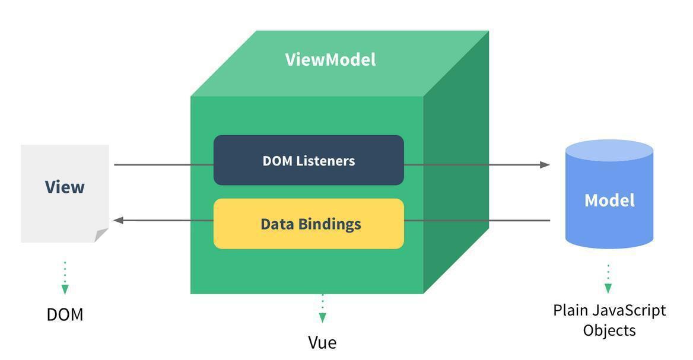

## 一、ES6 语法

`ECMAScript6.0`（以下简称ES6，ECMAScript是一种由Ecma国际通过ECMA-262标准化的脚本），是JavaScript语言的下一代标准，2015年6月正式发布，从ES6开始的版本号采用年号，如

- ES2015，就是ES6。
- ES2016，就是ES7。
- ES2017，就是ES8。

> ECMAScript是规范，JS的规范的具体实现。


### 1.let作用域

> var 声明的变量往往会越域，let 声明的变量有严格的作用域
>
> var 可以声明多次，let 只可以声明一次
>
> var 会变量提升，let 不存在

```html
<!DOCTYPE html>
<html lang="en">
<head>
    <meta charset="UTF-8">
    <title>let作用域</title>
</head>
<body>
<script>
    //var 声明的变量往往会越域 let 声明的变量有严格的作用域
    {
        var a = 1;
        let b = 2;
    }
    console.log(a); //1
    console.log(b); //ReferenceError: b is not defined

    //var 可以声明多次 let 只可以声明一次
    var m = 1;
    var m = 2;
    let n = 3;
    // let n = 4;

    console.log(m); //2
    console.log(n); //Identifier 'n' has already been declared


    //var 会变量提升 let 不存在变量提升
    console.log(x);// undefined
    var x = 10;

    console.log(y);//ReferenceError: y is not defined
    let y = 20;

    //const 声明之后不允许改变，并且一但声明必须初始化
    const a = 1;
    a = 3; //Uncaught TypeError: Assignment to constant variable.
</script>

</body>
</html>
```


### 2.解构表达式

> 支持数组结构 `let arr = [1,2,3]; let [a,b,c] = arr;` 
>
> 支持对象解构 `const {name:abc,age,language} = person;`                           
>
> 字符串拓展函数 `startsWith(),endsWith(),str.includes(),`               
>
> 字符串模板和占位符功能`${}`           

```html
<!DOCTYPE html>
<html lang="en">
<head>
    <meta charset="UTF-8">
    <title>解构表达式</title>
</head>
<body>
<script>
    //1.数组解构
    let arr = [1, 2, 3];

    //let a = arr[0]
    //let b = arr[1]
    //let c = arr[2]

    let [a,b,c] = arr;
    console.log(a, b, c);

    //2.对象解构
    const person = {
        name:'jack',
        age:21,
        language: ['java', 'javascript', 'python']
    }
    //const name = person.name;
    //const age = person.age;
    //const language = person.language;

    const {name:abc,age,language} = person;
    console.log(abc, age, language);

    //3.字符串扩展
    let str = "hello.vue";
    console.log(str.startsWith("hello"));
    console.log(str.endsWith(".vue"));
    console.log(str.includes("e"));
    console.log(str.substring(0, 4));

    //4.字符串模板
    let template = `
        <div>
            <h2>hello world</h2>
        </div>
    `

    function fun(){
        return "这是一个函数";
    }

    //5.${}表达式
    let info = `my name is ${abc}, i am ${age + 10} years old,and i want to say ${fun()}`;
    console.log(info);
</script>
</body>
</html>
```

​                                                   

### 3.函数优化

> 支持函数形参默认值 `function add(a,b=1){}`
>
> 支持函数形参不定参数 `function fun(...values){}`
>
> 支持箭头函数 `var print = obj => consolo.log(obj)`
>
> 箭头函数和对象解构 `var hello = ({name}) => console.log(name)`

```html
<!DOCTYPE html>
<html lang="en">
<head>
    <meta charset="UTF-8">
    <title>函数优化</title>
</head>
<body>
<script>
    //1.函数默认参数优化
    //在ES6之前，我们无法给一个函数参数设置默认参数，只能采用变通写法
    function add(a, b) {
        b = b || 1;
        return a + b;
    }

    console.log(add(10));
    console.log(add(10, 20));

    //在ES6语法中，我们可以在参数上添加默认值，没传就会自动使用默认值
    function add2(a, b = 1) {
        return a + b;
    }

    console.log(add2(10));
    console.log(add2(10, 20));

    //2.不定参数优化
    function fun(...values) {
        return values.length;
    }

    console.log(fun(1, 2))
    console.log(fun(1, 2, 3, 4, 5))


    //3.箭头函数与lambda表达式
    let print = function (obj) {
        console.log(obj);
    }
    print("hello");

    let print2 = obj => console.log(obj);
    print2("hello")

    let sum = function (a, b) {
        return a + b;
    };

    console.log(sum(10, 20));

    let sum2 = (a,b) => a + b;
    console.log(sum2(10, 20));

    //4.箭头函数与解构表达式
    const person = {
        name:'jack',
        age:21,
        language: ['java', 'javascript', 'python']
    }

    function hello(person) {
        console.log("hello" + person.name);
    }
    hello(person)

    let hello2 = ({name}) => console.log("hello," + name);
    hello2(person);

</script>
</body>
</html>
```


### 4.对象优化

> 对象方法 `Object.keys(),Object.values(),Object.entries(),Object.assign()`
>
> 对象属性简写 `const name = "java";const age = "23" const person = {name,age}`
>
> 对象函数简写 
>
> - 原先写法` eat:function(food){}       `
> - 简单写法 `eat(food){}`
> - 箭头函数写法 `eat:food => {} `
>
> 对象拓展运算符
>
> -  拷贝对象 `let person = {name:'Amy',age:15};let someone = {... person}`
>
> -  合并对象  
>
> - ```javascript
>   let name = {name:'Helly'};
>   let age = {age:15};
>   let person = {name:'mousse'};
>   person = {...name,...age};
>   console.log(person);//{name:'Helly',age:15}
>   ```

```html
<!DOCTYPE html>
<html lang="en">
<head>
    <meta charset="UTF-8">
    <title>对象优化</title>
</head>
<body>
<script>

    //1.对象方法
    const person = {
        name: 'jack',
        age: 21,
        language: ['java', 'javascript', 'python']
    }

    console.log(Object.keys(person));//["name", "age", "language"]
    console.log(Object.values(person));//["jack", 21, Array(3)]
    console.log(Object.entries(person));//[Array(2), Array(2), Array(2)]


    //2.对象合并
    const target = {a: 1};
    const source1 = {b: 2};
    const source2 = {c: 3};

    Object.assign(target, source1, source2);

    console.log(target);//{a:1,b:2,c:3}

    //3.对象简写
    const name = "java";
    const age = "23";
    const person1 = {name: name, age: age}
    const person2 = {name, age};

    console.log(person1);
    console.log(person2);

    //4.对象函数简写
    const person3 = {
        name: 'jack',
        //原先写法
        eat: function (food) {
            console.log(this.name + " eat " + food);
        },
        //简单写法
        eat2(food) {
            console.log(this.name + " eat " + food);
        },
        //箭头函数写法 箭头函数内部没有this
        eat3: food => console.log(person3.name + " eat " + food),
    }

    person3.eat("apple");
    person3.eat2("banana");
    person3.eat3("orange");

    //5.对象拓展运算符
    //拷贝对象，深拷贝
    let p1 = {name: 'Amy', age: 15}
    let someone = {...p1};
    console.log(someone);//{name:'Amy', age: 15}

    //合并对象
    let age1 ={age: 15}
    let name1 = {name: 'Helly'}
    let p2 = {name: 'Mousse'}
    p2 = {...age1, ...name1};
    console.log(p2);//{name:'Helly',age:15}

</script>
</body>
</html>
```


### 5.mapreduce

> map():接收一个函数，将原数组中的所有元素用这个函数函数处理后放入新数组返回
>
> reduce():为数组中的每一个元素依次执行回调函数，不包括数组中被删除或未被赋值的元素

```html
<!DOCTYPE html>
<html lang="en">
<head>
    <meta charset="UTF-8">
    <title>mapreduce</title>
</head>
<body>
<script>

    //map() 接收一个函数，将原数组中的所有元素用这个函数处理后放入新数组返回。
    let arr = [1, 20, -5, 30, 9];

    arr = arr.map(item => item * 2);

    console.log(arr);

    //reduce() 为数组中的每一个元素依次执行回调函数，不包括数组中被删除或从未被赋值的元素
    let result = arr.reduce((a, b) => {
        console.log("上一次处理后："+a);
        console.log("当前正在处理："+b);
        return a + b;
    }, 0)
    console.log(result);

</script>
</body>
</html>
```


### 6.异步优化promise

> user.json
>
> ```json
> {
>   "id": 1,
>   "name": "zhangsan",
>   "password": "123456"
> }
> ```
>
> user_course_1.json
>
> ```json
> {
>   "id": 10,
>   "name": "chinese"
> }
> ```
>
> user_score_10.json
>
> ```json
> {
>   "id": 100,
>   "score": 90
> }
> ```

```html
<!DOCTYPE html>
<html lang="en">
<head>
    <meta charset="UTF-8">
    <title>promise异步操作优化</title>
    <script src="https://cdn.bootcss.com/jquery/3.4.1/jquery.min.js"></script>
</head>
<body>
<script>
    //需求:查询当前用户信息，按照当前用户的id查询课程，根据课程id获取分数

    //1.通过ajax封装异步操作，会造成层级嵌套过深
    $.ajax({
        url: "./mock/user.json",
        success(data) {
            console.log(data);
            $.ajax({
                url: `./mock/user_course_${data.id}.json`,
                success(data) {
                    console.log(data);
                    $.ajax({
                        url: `./mock/user_score_${data.id}.json`,
                        success(data) {
                            console.log("查询到分数：", data);
                        },
                        error(error) {
                            console.log("出现异常了：" + error);
                        }
                    })
                }
            })
        }
    });

    //promise封装异步操作，更符合人的逻辑
    let p = new Promise(((resolve, reject) => {
        $.ajax({
            url: 'mock/user.json',
            success(data) {
                resolve(data);
            },
            error(error) {
                reject(error);
            }
        })
    }));

    p.then(res => {
        console.log("上一步的结果", res)
        return new Promise(((resolve, reject) => {
            $.ajax({
                url: `mock/user_course_${res.id}.json`,
                success(data) {
                    resolve(data);
                },
                error(error) {
                    reject(error);
                }
            });
        }))
    }).then(res => {
        console.log("上一步的结果", res)
        return new Promise(((resolve, reject)=>{
            $.ajax({
                url: `mock/user_score_${res.id}.json`,
                success(data) {
                    console.log("查询课程得分成功:", data)
                },
                error(error) {
                    reject(error);
                }
            });
        }))
    })


    //通过promise封装ajax请求
    function get(url, data) {
        return new Promise((resolve, reject) =>{
            $.ajax({
                url:url,
                data:data,
                success(data) {
                    resolve(data);
                },
                error(error) {
                    reject(error);
                }
            })
        });
    }

    get("mock/user.json")
        .then((data) => {
            console.log("用户查询成功~~~:", data)
            return get(`mock/user_course_${data.id}.json`);
        })
        .then((data) => {
            console.log("课程查询成功~~~:", data)
            return get(`mock/user_score_${data.id}.json`);
        })
        .then((data)=>{
            console.log("课程成绩查询成功~~~:", data)
        })
        .catch((err)=>{ //失败的话catch
            console.log("出现异常",err)
        });


</script>
</body>
</html>
```


### 7.模块化import/export

> 模块化就是把代码进行拆分，方便重复利用。模块化功能主要有两个命令构成
>
> - export用于规定模块的对外接口
> - import用于导入其他模块提供的功能

**user.js**

```json
let name = "jack";
let age = 23;

function add(a, b) {
    return a + b;
}

//导出变量和方法
export {name, age, add}
```

**hello.js**

```json
// 这个导出不能重命名
// export const  util = {
//     sum(a, b) {
//         return a + b;
//     }
// }
// export {util}

//导出后可以重命名
export default {
    sum(a,b){
        return a + b;
    }
}


//`export`不仅可以导出对象，一切JS变量都可以导出。
//比如：基本类型变量、函数、数组、对象。
```

**main.js**

```json
import abc from './hello';
import {name, add} from './user';

abc.sum(1, 2);
console.log(name);
add(1, 3);
```


## 二、Vue初体验

> Vue是一个渐进式的框架，什么是渐进式框架呢？
>
> - 渐进式意味着你可以将Vue作为你应用的一部分嵌入，带来更丰富的交互体验
> - 如果你希望将更多的业务逻辑使用Vue实现，那么你开业使用Vue的核心库以及其生态系统
>   - Vue CLI:Vue 脚手架，用于构建项目
>   - Vue Router:Vue 路由器，用户路径跳转
>   - Vuex:Vue 状态管理工具
>
> Vue有很多特点和Web开发中常见的高级功能
>
> - 解耦视图和数据
> - 可复用的组件
> - 前端路由技术
> - 状态管理
> - 虚拟DOM

### 1.Vue安装

方式一：直接CDN引入

```javascript
<!-- 开发环境版本，包含了有帮助的命令行警告 --> 
<script src="https://cdn.jsdelivr.net/npm/vue/dist/vue.js"></script>
<!-- 生产环境版本，优化了尺寸和速度 -->
<script src="https://cdn.jsdelivr.net/npm/vue"></script>
```

方式二：下载和引入

```
开发环境 https://vuejs.org/js/vue.js 
生产环境 https://vuejs.org/js/vue.min.js
```

方式三：NPM安装

```
通过webpack和vue cli的使用，完成vue的安装
```


### 2.Vue入门

> Vue创建对象，传入了一些option:{}
>
> - {}中包含了el属性：该属性决定了Vue对象挂载到哪一个元素上
> - {}中包含了data属性：该属性中通常会存储一些数据

```html
<!DOCTYPE html>
<html lang="en">
<head>
    <meta charset="UTF-8">
    <title>Vue入门</title>
</head>
<body>
<div id="message"></div>
<div id="app">{{message}}</div>

</body>
<script src="https://cdn.jsdelivr.net/npm/vue/dist/vue.js"></script>

<script>

    //编程范式：声明式编程  数据和页面分离
    const app = new Vue({
        el:"#app",
        data:{
            message: "hello,world"
        }
    });

    //传统js做法（编程范式：命令式编程）
    //1.创建div元素，设置id属性
    //2.定义一个变量为message
    //3.将message变量放在前面的div元素中显示

</script>

</html>
```


### 3.Vue列表

> 声明式编程：数据和页面分离
>
> 响应式布局：当数据改变，页面会自动修改

```html
<!DOCTYPE html>
<html lang="en">
<head>
    <meta charset="UTF-8">
    <title>Title</title>
</head>
<body>

<div id="app">
     <ul>
         <li v-for="item in movies">{{item}}</li>
     </ul>
</div>

</body>
<script src="https://cdn.jsdelivr.net/npm/vue/dist/vue.js"></script>

<script>
    //响应式布局，当数据发生改变后，页面会自动进行修改
    new Vue({
        el:"#app",
        data:{
            movies:['星际穿越','大话西游','盗梦空间','流浪地球']
        }
    })

</script>
</html>
```


### 4.Vue计数器

> MVVM是Model-View-ViewModel的简写。它本质上就是MVC 的改进版。MVVM 就是将其中的View 的状态和行为抽象化，让我们将视图 UI 和业务逻辑分开。
>
> 
>
> MVVM
>   Model
>       1.数据层 data:{}
>       2.可能是服务器的数据，也也能是固定数据
>
>   View:
>       1.视图层:`<div id="app"></>`
>       2.在前端开发中，通常就是DOM层
>       3.主要的作用是给用户展示各种数据
>
>   ViewModel:
>       1.视图模型层:new Vue()
>       2.是 View 和 Model 沟通的桥梁
>       3.一方面实现了 Data Binding ，也就是数据绑定，将 Model 的改变实时的反映到 View 中
>       4.一方面实现了 Dom Listener ，也就是DOM监听，当 DOM 发生一些事件，会改变对应 View
>
> 

```html
<!DOCTYPE html>
<html lang="en">
<head>
    <meta charset="UTF-8">
    <title>Title</title>
</head>
<body>

<!-- view 显示部分 -->
<div id="app">
    <h2>当前计数：{{counter}}</h2>
    <button @click="counter++;">+</button>
    <button @click="counter--;">-</button>

    <br/>
    <button @click="add()">+</button>
    <button @click="sub()">-</button>

</div>

</body>

<script src="https://cdn.jsdelivr.net/npm/vue/dist/vue.js"></script>
<script>

    /**
    * 函数和方法的区别
    *   函数是一段代码，通过名字来调用，和对象无关
    *   函数是一段代码，通过名字来调用，但是对象关联
    *
    *
    * MVVM
    *   Model
    *       1.数据层 data:{}
    *       2.可能是服务器的数据，也也能是固定数据
    *
    *   View:
    *       1.视图层:<div id="app"></>
    *       2.在前端开发中，通常就是DOM层
    *       3.主要的作用是给用户展示各种数据
    *
    *   ViewModel:
    *       1.视图模型层:new Vue()
    *       2.是 View 和 Model 沟通的桥梁
    *       3.一方面实现了 Data Binding ，也就是数据绑定，将 Model 的改变实时的反映到 View 中
    *       4.一方面实现了 Dom Listener ，也就是DOM监听，当 DOM 发生一些事件，会改变对应 View
    *
    * 1.当页面显示 Vue 实例中定义的 data 定义的数据，当 data 改变，页面也会跟着改变，这是响应式布局
    *   Model 通过Vue实例中的 ViewModel 的 Data Bindings 事件，修改 View 中的 DOM
    *
    * 2.当页面绑定了事件后，点击事件对数据进行修改，VUE 实例中的 ViewModel 的 DOM Listeners 会通过
    *   Plain JavaScript Objects 对 Model 进行修改，并且通过数据绑定重新修改 View 在页面上的值
    * */


    new Vue({
        el: "#app",

        //data bindings
        data: {
            counter: 0
        },

        //dom listeners
        methods: {
            add() {
                this.counter++;
            },
            sub() {
                this.counter--;
            }
        }
    })

</script>
</html>
```


### 5.Vue生命周期

> Vue创建实例传入的options
>
> - **el:**
>   - 类型：String | HTMLELement
>   - 作用：决定Vue会管理哪一个DOM
> - **data:**
>   - 类型：Object | Function （组件中data必须是一个函数）
>   - 作用：Vue实例对应的数据对象
> - **methods:**
>   - 类型：{ [ key : string] : Function }
>   - 作用：定义属于Vue的一些方法，可以在其他地方调用，也可以在指令中使用
>
> 下图展示了实例的生命周期。
>
> 

```html
<!DOCTYPE html>
<html lang="en">
<head>
    <meta charset="UTF-8">
    <title>生命周期</title>
</head>
<body>
<div id="app">
    <span id="num">{{num}}</span>
    <button @click="num++">赞！</button>
    <h2>{{name}}，有{{num}}个人点赞</h2>
</div>
</body>
<script src="https://cdn.jsdelivr.net/npm/vue/dist/vue.js"></script>
<script>
    let app = new Vue({
        el: "#app",
        data: {
            name: "张三",
            num: 100
        },
        methods: {
            show() {
                return this.name;
            },
            add() {
                this.num++;
            }
        },
        beforeCreate() {
            console.log("=========beforeCreate=============");
            console.log("数据模型未加载：" + this.name, this.num);
            console.log("方法未加载：" + this.show());
            console.log("html模板未加载：" + document.getElementById("num"));
        },
        created: function () {
            console.log("=========created=============");
            console.log("数据模型已加载：" + this.name, this.num);
            console.log("方法已加载：" + this.show());
            console.log("html模板已加载：" + document.getElementById("num"));
            console.log("html模板未渲染：" + document.getElementById("num").innerText);
        },
        beforeMount() {
            console.log("=========beforeMount=============");
            console.log("html模板未渲染：" + document.getElementById("num").innerText);
        },
        mounted() {
            console.log("=========mounted=============");
            console.log("html模板已渲染：" + document.getElementById("num").innerText);
        },
        beforeUpdate() {
            console.log("=========beforeUpdate=============");
            console.log("数据模型已更新：" + this.num);
            console.log("html模板未更新：" + document.getElementById("num").innerText);
        },
        updated() {
            console.log("=========updated=============");
            console.log("数据模型已更新：" + this.num);
            console.log("html模板已更新：" + document.getElementById("num").innerText);
        }
    });
</script>

</html>
```


## 三、Vue基本语法

> 基本语法有插值操作，简单属性，绑定属性，双向绑定，事件监听，条件判断，循环遍历，计算属性，阶段案例

### 1.插值操作

```html
<!DOCTYPE html>
<html lang="en">
<head>
    <meta charset="UTF-8">
    <title>mustache插值操作</title>
</head>
<body>
<div id="app">
    <h2>{{message}}</h2>
    <h2>{{message}},cookie mousse</h2>
    <h2>{{firstName + lastName}}</h2>
    <h2>{{firstName + '·' + lastName}}</h2>
    <h2>{{counter * 2}}</h2>
</div>
</body>

<script src="https://cdn.jsdelivr.net/npm/vue/dist/vue.js"></script>
<script>
    const app = new Vue({
        el: "#app",
        data: {
            message: "hello,world",
            firstName: "cookie",
            lastName: "mousse",
            counter: 100,
        }
    });
</script>
</html>

```


### 2.简单属性

```html
<!DOCTYPE html>
<html lang="en">
<head>
    <meta charset="UTF-8">
    <title>简单指令的使用</title>
</head>
<style>
    [v-cloak] {
        display: none;
    }
</style>
<body>
<div id="app">
    <h2>{{message}}</h2>
    <!-- 只使用一次 -->
    <h2 v-once>{{message}}</h2>
    <!-- 显示html -->
    <h2 v-html="url"></h2>
    <!-- 转义，原封不动的展示 -->
    <h2 v-pre> > </h2>
    <h2 v-pre> {{message}}</h2>
    <!-- 解决插值闪烁问题 -->
    <h2 v-cloak> {{message}}</h2>
</div>
</body>

<script src="https://cdn.jsdelivr.net/npm/vue/dist/vue.js"></script>
<script>
    const app = new Vue({
        el: "#app",
        data: {
            message: "hello,world",
            url: `<a href="https://www.baidu.com">百度一下</a>`
        }
    });
</script>
</html>
```


### 3.绑定属性 v-bind

```html
<!DOCTYPE html>
<html lang="en">
<head>
    <meta charset="UTF-8">
    <title>v-bind单项绑定</title>
</head>
<style>
    .active {
        color: red;
    }
</style>
<body>
<div id="app">
    <!-- 可以对class进行添加 -->
    <h2 class="title" :class="{active:isActive}">{{message}}</h2>
    <button @click="changeHandle">改变颜色</button>
    <br/>

    <!-- v-bind:src 语法糖 :scr -->
    
    <!-- {} 对象 可以放入键值对 -->
    
</div>
</body>

<script src="https://cdn.jsdelivr.net/npm/vue/dist/vue.js"></script>
<script>
    const app = new Vue({
        el: "#app",

        data: {
            message: "hello,world",
            url: 'https://cn.vuejs.org/images/lifecycle.png',
            isActive: true
        },

        methods: {
          changeHandle() {
                this.isActive = !this.isActive;
            }
        }
    });
</script>
</html>
```


### 4.双向绑定 v-model

```html
<!DOCTYPE html>
<html lang="en">
<head>
    <meta charset="UTF-8">
    <title>v-model双向绑定</title>
</head>
<body>
<div id="app">
    <!-- v-model -->
    <input v-model="message" type="text">
    <h2>{{message}}</h2>

    <!--
        自定义实现 v-model效果
        @input是input的默认事件
            @input的2中绑定事件的写法
                1.@input="changeHandler($event)
                2.@input="changeHandler

     -->
    <input type="text" :value="message" @input="changeHandler($event)">
    <h2>{{message}}</h2>

    <!--
        定义实现 v-model效果另一种写法
    -->
    <input type="text" :value="message" @input="message = $event.target.value">
    <h2>{{message}}</h2>


    <!--
        v-model的修饰符
            v-model.lazy:懒加载
            v-model.number:数字
            v-model.trim:删除空格
    -->
    <input v-model.lazy="message" type="text">
    <input v-model.number="message" type="text">
    <h2>{{message}}</h2>

</div>
</body>

<script src="https://cdn.jsdelivr.net/npm/vue/dist/vue.js"></script>
<script>
    const app = new Vue({
        el: "#app",
        data: {
            message: "hello,world"
        },
        methods: {
            changeHandler(event) {
                this.message = event.target.value;
            }
        }
    });
</script>
</html>
```


### 5.事件监听 v-on

```html
<!DOCTYPE html>
<html lang="en">
<head>
    <meta charset="UTF-8">
    <title>v-on监听事件</title>
</head>
<body>

<!-- view 显示部分 -->
<div id="app">
    <h2>当前计数：{{counter}}</h2>
    <button @click="counter++;">+</button>
    <button @click="counter--;">-</button>

    <br/>
    <button @click="add()">+</button>
    <!--
        在事件自定义中，方法可以省略括号，但是方法本身是需要一个参数的
        所有Vue会默认将浏览器的event事件对象作为餐宿传入到方法中
        可以手动传入$event
     -->
    <button @click="sub(message,$event)">-</button>

    <!--
        默认修饰符
            .prevent阻止默认事件
    -->
    <form action="https://www.baidu.com">
        <input type="submit" value="提交" @click.prevent="submitClick()">
    </form>

    <!--
        监听某个键盘点击事件
         .{ keyCode | KeyAlias}
            keyCode:键盘code
            keyAlias:键盘别称
    -->
    <input type="text" @keyup="submitClick" value="键盘点击事件">
    <input type="text" @keydown="submitClick" value="键盘下压事件">
    <input type="text" @keyup.enter="submitClick" value="键盘点击回车事件">

    <!--
        自定义组件的监听事件
            .native
          只执行一次监听事件
            .once
        <cpn @click.native="submitClick"></cpn>
    -->
</div>

</body>

<script src="https://cdn.jsdelivr.net/npm/vue/dist/vue.js"></script>
<script>

    new Vue({
        el: "#app",

        data: {
            counter: 0,
            message: "hello,world"
        },

        methods: {
            add() {
                this.counter++;
            },
            sub(str, event) {
                console.log(str)
                console.log(event);
                this.counter--;
            },

            //提交测试
            submitClick(){
                console.log("hello console");
            }
        }
    })

</script>
</html>
```


### 6.条件判断 v-if

> v-if条件判断

```html
<!DOCTYPE html>
<html lang="en">
<head>
    <meta charset="UTF-8">
    <title>v-if条件判断</title>
</head>
<body>
<div id="app">
    <button v-on:click="random=Math.random()">点我呀</button>
    <span>{{random}}</span>

    <h1 v-if="random>=0.75">
        看到我啦? &gt; =0.75
    </h1>
    <h1 v-else-if="random>=0.5">
        看到我啦? &gt; =0.5
    </h1>
    <h1 v-else-if="random>=0.2">
        看到我啦? &gt;= 0.2
    </h1>
    <h1 v-else>
        看到我啦? &lt; 0.2
    </h1>

    <h2>用户登录案例</h2>

    <!--
        虚拟DOM复用使用相同的input，解决方案，加上内置属性key或使用v-model
    -->
    <span v-if="isUser">
        <label for="username">用户账号</label>
        <input type="text" id="username" v-model="user.username"  placeholder="用户账号" key="usernmae">
    </span>
    <span v-else>
        <label for="email">用户邮箱</label>
        <input type="text" id="email" v-model="user.email" placeholder="用户邮箱" key="email">
    </span>
    <button @click="isUser = !isUser">切换类型</button>
</div>
</body>

<script src="https://cdn.jsdelivr.net/npm/vue/dist/vue.js"></script>
<script>
    const app = new Vue({
        el: "#app",
        data: {
            random: 1 ,
            isUser: true,
            user:{
                email: '',
                username:'',
            }
        }
    });
</script>
</html>
```

> v-if和v-show的区别

```html
<!DOCTYPE html>
<html lang="en">
<head>
    <meta charset="UTF-8">
    <title>v-if和v-show的区别</title>
</head>
<body>
<div id="app">
    <!-- v-if:当条件为false,这个标签完全不会存在dom中 -->
    <h2 v-if="isShow" id="aaa">{{message}}</h2>
    <!-- v-show:当条件为false,v-show只是给我们的元素添加一个行内样式: display:none -->
    <h2 v-show="isShow" id="bbb">{{message}}</h2>
    <!-- v-if在只切换一次的时候使用合适，v-show在频繁切换的时候使用合适 -->
</div>
</body>

<script src="https://cdn.jsdelivr.net/npm/vue/dist/vue.js"></script>
<script>
    const app = new Vue({
        el: "#app",
        data: {
            message: "hello,world",
            isShow: true
        }
    });
</script>
</html>
```


### 7.循环遍历 v-for

```html
<!DOCTYPE html>
<html lang="en">
<head>
  <meta charset="UTF-8">
  <title>v-for数组对象的遍历</title>
</head>
<body>
<div id="app">
  <!-- 遍历数组 -->
  <ul>
    <li v-for="(num,index) in nums" :key="index">{{num}}</li>
  </ul>

  <!-- 遍历对象 -->
  <ul>
    <!-- 4、遍历的时候都加上:key来区分不同数据，提高vue渲染效率 -->
    <li v-for="(user,index) in users" :key="user.name" v-if="user.gender === '女'">
      <!-- 1、显示user信息：v-for="item in items" -->
      当前索引：{{index}} ==> {{user.name}}  ==>
      {{user.gender}} ==>{{user.age}} <br>
      <!-- 2、获取数组下标：v-for="(item,index) in items" -->
      <!-- 3、遍历对象：
              v-for="value in object"
              v-for="(value,key) in object"
              v-for="(value,key,index) in object"
      -->
      对象信息：
      <span v-for="(v,k,i) in user">{{k}}=={{v}}=={{i}};</span>
      <!-- 4、遍历的时候都加上:key来区分不同数据，提高vue渲染效率 -->
    </li>
  </ul>
</div>
</body>

<script src="https://cdn.jsdelivr.net/npm/vue/dist/vue.js"></script>
<script>
  let app = new Vue({
    el: "#app",
    data: {
      users: [
        { name: '柳岩', gender: '女', age: 21 },
        { name: '张三', gender: '男', age: 18 },
        { name: '范冰冰', gender: '女', age: 24 },
        { name: '刘亦菲', gender: '女', age: 18 },
        { name: '古力娜扎', gender: '女', age: 25 }
      ],
      nums: [1,2,3,4,4]
    },
  })
</script>
</html>
```

> v-for和v-bind结合案例

```html
<!DOCTYPE html>
<html lang="en">
<head>
    <meta charset="UTF-8">
    <title>v-for和v-bind结合</title>
</head>

<style>
    .active {
        color: red;
    }
</style>
<body>

<div id="app">

    <!--
        没有key的时候是数组，加上key以后绑定元素以后是链表，绑定index没有链表的效果


        通过数组索引修改不是响应式的
            this.letters[0] = 'bbb';
            vue内部实现的函数,页面也会刷新
                Vue.set(this.letters,0,'bbb')

        响应式的数组方法
            this.letters.push();最数组尾部添加元素

            this.letters.pop();删除数组中最后一个元素

            this.letters.shift();删除数组中第一个元素

            this.letters.unshift();添加数组中第一个元素

            this.letters.splice();可以添加元素，删除元素，替换元素
                letters.splice(2,0,'g') 在第二个元素下面删除0个并追加g
                letters.splice(1,3) 删除第一个元素下后3个元素
                letters.splice(1,1,'g') 在第一个元素下的后一个元素替换成g
                letters.splice(1,2,'g','h') 在第一个元素下的后2个元素替换成g,h

            this.letters.sort();数组排序

            this.letters.reverse();数组反转

    -->
    <ul>
        <li v-for="item in list" :key="item">{{item}}</li>
    </ul>

    <ul>
        <!-- v-for 数组用法 (value,index) in list -->
        <li v-for="(movie,index) in movies"
            :class="{active: currentIndex === index}"
            @click="clickHandle(index)"
            :key="index">
            {{index + 1}}{{movie}}
        </li>

    </ul>

    <!-- v-for的全格式对象用法 (value,key,index) in list  -->


</div>
</body>

<script src="https://cdn.jsdelivr.net/npm/vue/dist/vue.js"></script>
<script>
    const app = new Vue({
        el: "#app",
        data: {
            list: ['a', 'b', 'c', 'd', 'e', 'f'],
            letters: ['a', 'b', 'c', 'd', 'e', 'f'],
            movies: ['星际穿越', '大话西游', '盗梦空间', '流浪地球'],
            currentIndex: 0,
        },
        methods: {
            clickHandle(index) {
                this.currentIndex = index;
            },

        }
    })
</script>
</html>
```


### 8.计算属性 computed

```html
<!DOCTYPE html>
<html lang="en">
<head>
    <meta charset="UTF-8">
    <title>Computed计算属性</title>
</head>
<body>
<div id="app">
    <h2>{{fullName}}</h2>
    <h2>{{totalPrice}}</h2>
</div>
</body>

<script src="https://cdn.jsdelivr.net/npm/vue/dist/vue.js"></script>
<script>
    const app = new Vue({
        el: "#app",
        data: {
            firstName: "cookie",
            lastName: "mousse",
            books: [
                {id: 100, name: "Unix编译原理", price: 100},
                {id: 101, name: "代码大全", price: 139},
                {id: 102, name: "深入理解计算机原理", price: 99},
                {id: 103, name: "现代操作系统", price: 123},
            ]
        },
        /*
        * 计算属性和methods的区别
        *   多次执行后，如果属性没有改变，则计算属性会缓存，只调用一次，
        *   而methods每次都会重新调用，
        *
        * */
        computed: {
            //样式看起来是函数，其实是一个属性
            fullName() {
                return this.firstName + " " + this.lastName;
            },
            //计算所有书本的价格
            totalPrice() {
                //price 上一次调用返回的值，或者是提供的初始值
                //book  数组中当前被处理的元素
                return this.books.reduce((price, book) => {
                    return price + book.price;
                }, 0);
            }
        }
    });
</script>
</html>
```


### 9.购物车案例

```html
<!DOCTYPE html>
<html lang="en">
<head>
    <meta charset="UTF-8">
    <title>购物车案例</title>
</head>
<body>
<div id="app">
    <div v-if="books.length">
        <table>
            <thead>
            <tr>
                <th></th>
                <th>书籍名称</th>
                <th>出版日期</th>
                <th>价格</th>
                <th>购买数量</th>
                <th>操作</th>
            </tr>
            </thead>
            <tbody>
            <tr v-for="(item,index) in books">
                <!--
                <td v-for="value in item">{{value}}</td>
                -->
                <td>{{item.id}}</td>
                <td>{{item.name}}</td>
                <td>{{item.date}}</td>
                <!-- 过滤器的使用 -->
                <td>{{item.price | showPrice }}</td>
                <td>
                    <button @click="add(index)">+</button>
                    {{item.count}}
                    <!-- 动态绑定属性 -->
                    <button @click="sub(index)" :disabled="item.count <= 1">-</button>
                </td>
                <td>
                    <button @click="removeHandler(index)">移除</button>
                </td>
            </tr>
            </tbody>
        </table>
        <h2>总价格:{{ totalPrice | showPrice}}</h2>
    </div>
    <div v-else>
        <h2>购物车为空</h2>
    </div>
</div>
</body>

<script src="https://cdn.jsdelivr.net/npm/vue/dist/vue.js"></script>
<script>
    const app = new Vue({
        el: "#app",
        data: {
            books: [
                {id: 1, name: '算法导论', date: '2015-3', price: 85.00, count: 1},
                {id: 2, name: 'UNIX编程艺术', date: '2011-3', price: 35.00, count: 1},
                {id: 3, name: '编程珠玑', date: '2011-2', price: 55.00, count: 1},
                {id: 4, name: '代码大全', date: '2010-3', price: 59.00, count: 1},
            ]
        },
        methods: {
            add(index) {
                this.books[index].count++;
            },
            sub(index) {
                this.books[index].count--;
            },
            removeHandler(index) {
                this.books.splice(index, 1)
            }
        },
        computed: {

            totalPrice() {
                //1.普通for循环

                // let totalPrice = 0;
                // for (let i = 0; i < this.books.length; i++) {
                //     totalPrice += this.books[i].price * this.books[i].count;
                // }
                // return totalPrice;

                //2.增强for循环

                // let totalPrice = 0;
                // for (let book of this.books) {
                //     totalPrice += book.price * book.count;
                // }
                // return totalPrice;

                // 3.reduce 写法

                return this.books.reduce((price, book) => {
                    return price + book.price * book.count;
                }, 0);
            }
        },
        filters: {
            showPrice(price) {
                return '￥' + price.toFixed(2)
            }
        }
    });
</script>
<style>
    table {
        border: 1px solid #e9e9e9;
        border-collapse: collapse;
        border-spacing: 0;
    }

    th, td {
        padding: 8px 16px;
        border: 1px solid #e9e9e9;
        text-align: left;
    }

    th {
        background-color: #f7f7f7;
        color: #5c6b77;
        font-weight: 600;

    }
</style>
</html>
```


## 四、Vue组件化开发

### 1.全局组件

```html
<!DOCTYPE html>
<html lang="en">
<head>
    <meta charset="UTF-8">
    <title>组件入门</title>
</head>
<body>
<div id="app">
    <cpn></cpn>
    <cpn></cpn>
    <cpn></cpn>
    <cpn></cpn>
</div>
</body>

<script src="https://cdn.jsdelivr.net/npm/vue/dist/vue.js"></script>
<script>

    //1.创建组件构造器对象
    const cpn = Vue.extend({
        template: `
        <div>
            <h2>组件化的使用</h2>
            <p>1.调用Vue.extend()方法创建组件构造器</p>
            <p>2.调用Vue.component()方法注册组件</p>
            <p>3.在Vue实例的作用范围内使用组件</p>
        </div>
        `
    });

    //2.注册组件(全局组件，可以在多个Vue实例中使用)
    Vue.component('cpn',cpn)

    //注册组件的语法糖
/*    Vue.component('cpn', {
        base: `
        <div>
            <h2>组件化的使用</h2>
            <p>1.调用Vue.extend()方法创建组件构造器</p>
            <p>2.调用Vue.component()方法注册组件</p>
            <p>3.在Vue实例的作用范围内使用组件</p>
        </div>
        `
    })*/

    const app = new Vue({
        el:"#app",
        data:{
            message: "hello,world"
        }
    });
</script>
</html>
```

### 2.局部组件

```html
<!DOCTYPE html>
<html lang="en">
<head>
    <meta charset="UTF-8">
    <title>局部组件</title>
</head>
<body>
<div id="app">
    <my-cpn></my-cpn>
</div>


</body>

<script src="https://cdn.jsdelivr.net/npm/vue/dist/vue.js"></script>
<script>

    //1.创建组件构造器对象
    const cpn = {
        template: `
        <div>
            <h2>局部化组件使用</h2>
            <p>1.调用Vue.extend()方法创建组件构造器</p>
            <p>2.在Vue实例的作用范围内注册组件</p>
            <p>3.在Vue实例的作用范围内使用组件</p>
        </div>
        `
    }


    const app = new Vue({
        el: "#app",
        data: {
            message: "hello,world"
        },
        components: {
            myCpn: cpn
        }
    });


</script>
</html>
```


### 3.父子组件

```html
<!DOCTYPE html>
<html lang="en">
<head>
    <meta charset="UTF-8">
    <title>父子组件</title>
</head>
<body>
<div id="app">
    <cpn></cpn>
</div>
</body>

<script src="https://cdn.jsdelivr.net/npm/vue/dist/vue.js"></script>
<script>

    //创建组件构造器对象(son cpn)
    const sonCpn = Vue.extend({
        template: `
        <div>
            <h2>子组件的使用</h2>
            <p>1.调用Vue.extend()方法创建组件构造器</p>
            <p>2.在Vue实例的作用范围内注册组件</p>
            <p>3.在Vue实例的作用范围内使用组件</p>
        </div>
        `
    });

    //创建组件构造器(father cpn)  -> render函数
    const fatherCpn = Vue.extend({
        template: `
        <div>
            <h2>父组件的使用</h2>
            <p>1.调用Vue.extend()方法创建组件构造器</p>
            <p>2.在Vue实例的作用范围内注册组件</p>
            <p>3.在Vue实例的作用范围内使用组件</p>
            <cpn></cpn>
        </div>
        `,
        components:{
            cpn: sonCpn
        }
    });


    //root,顶部组件
    const app = new Vue({
        el:"#app",
        data:{
            message: "hello,world"
        },
        components: {
            cpn: fatherCpn
        }
    });
</script>
</html>
```


### 4.组件模板

```html
<!DOCTYPE html>
<html lang="en">
<head>
    <meta charset="UTF-8">
    <title>组件入门</title>
</head>
<body>
<div id="app">
    <cpn></cpn>
    <cpn></cpn>
    <cpn></cpn>
    <cpn></cpn>

</div>
</body>
<script src="https://cdn.jsdelivr.net/npm/vue/dist/vue.js"></script>

<template id="cpn">
    <div>
        <h2>组件化的使用</h2>
        <p>1.调用Vue.extend()方法创建组件构造器</p>
        <p>2.调用Vue.component()方法注册组件</p>
        <p>3.在Vue实例的作用范围内使用组件</p>
    </div>
</template>

<script>


    //2.注册组件(全局组件，可以在多个Vue实例中使用)
    Vue.component('cpn', {
        template: '#cpn'
    })

    const app = new Vue({
        el: "#app",
        data: {
            message: "hello,world"
        }
    });
</script>
</html>
```


### 5.data函数
```html
<!DOCTYPE html>
<html lang="en">
<head>
    <meta charset="UTF-8">
    <title>组件data函数</title>
</head>
<body>
<div id="app">
    <cpn></cpn>

    <!--
        每个组件数据互不影响
    -->
    <btn></btn>
    <btn></btn>
    <btn></btn>

</div>
</body>
<script src="https://cdn.jsdelivr.net/npm/vue/dist/vue.js"></script>

<template id="cpn">
    <div>
        <h2>{{title}}</h2>
        <!--
            对象data和函数data的区别就是类变量和实例变量的区别
         -->
        <p>1.组件对象也有一个data属性，methods属性</p>
        <p>2.这个data必须是一个函数，如果不是函数，对象数据会相互影响</p>
        <p>3.而且这个函数返回一个对象，对象内部保存着数据</p>
    </div>
</template>


<template id="btn">
    <div>
        <h2>当前计数 {{counter}}</h2>
        <button @click="counter++">+</button>
        <button @click="counter--">-</button>
    </div>
</template>

<script>


    //注册组件(全局组件，可以在多个Vue实例中使用)
    Vue.component('cpn', {
        template: '#cpn',
        data() {
            return {
                title: "组件data函数",
            }
        }
    })

    Vue.component("btn", {
        template: '#btn',
        data() {
            return {
                title: "组件data函数",
                counter: 0,
            }
        }
    })

    const app = new Vue({
        el: "#app",
        data: {
            message: "hello,world"
        }
    });
</script>
</html>

```

### 6.组件通信-父传子props
```html
<!DOCTYPE html>
<html lang="en">
<head>
    <meta charset="UTF-8">
    <title>组件通信-父传子props</title>
</head>
<body>
<div id="app">
    <!--
        父组件向子组件传值，通过v-bind单向绑定实现，并且可以使用驼峰命名
    -->
    <cpn :c-movies="movies" :c-message="message"></cpn>
</div>
</body>

<script src="https://cdn.jsdelivr.net/npm/vue/dist/vue.js"></script>

<!--
    子组件的数据显示
-->
<template id="cpn">
    <div>
        <h2>{{cMessage}}</h2>
        <ul>
            <li v-for="item in cMovies"> {{item}}</li>
        </ul>
    </div>
</template>
<script>

    //声明一个全局组件
    const cpn = {
        template: '#cpn',

        props: {
            //传入的参数限制
            value: [Number, String],

            //传入的类型限制，如果传入的类型是对象或数组，默认值必须是一个函数
            cMovies: {
                type: Array,
                default() {
                    return []
                }
            },

            //提供一些默认值，是否必传
            cMessage: {
                type: String,
                default: 'default value',
                required: true,
            },
        },
        data() {
            return {}
        }
    }


    const app = new Vue({
        el: "#app",
        data: {
            message: "hello,world",
            movies: ['海贼王', '海扁王', '海尔兄弟']
        },
        components: {
            cpn: cpn
        }
    });
</script>
</html>

```

### 7.组件通信-子传父$emit
```html
<!DOCTYPE html>
<html lang="en">
<head>
    <meta charset="UTF-8">

    <title>组件通信-子传父$emit</title>
</head>
<body>
<div id="app">
    <!--
       监听子组件的事件,默认将数据传入方法中
   -->
    <com @item-click="cnpClick"></com>
    <cpn v-model="category"></cpn>
    <h2>{{category}}</h2>
</div>
</body>
<script src="https://cdn.jsdelivr.net/npm/vue/dist/vue.js"></script>
<!-- 通过绑定input事件和v-model将数据双向绑定 -->
<template id="cpn">
    <div>
        <button v-for="category in categories" @click="btnHandler(category)">
            {{category.name}}
        </button>
    </div>
</template>
<!-- 通过自定义方法item-click返回父组件数据，并执行cnpClick方法将值赋值 -->
<template id="com">
  <div>
    <button v-for="category in categories" @click="btnHandler(category)">
      {{category.name}}
    </button>
  </div>
</template>
<script>

    const cpn = {
        template: '#cpn',

        data() {
            return {
                categories: [
                    {id: 100, name: '热门手机'},
                    {id: 101, name: '手机数码'},
                    {id: 102, name: '家用家电'},
                    {id: 103, name: '电脑办公'},
                ]
            }
        },

        methods: {
            //将子组件的数据返回到父组件
            btnHandler(category) {
                this.$emit('input', category.name);
            }
        }
    }


    const com = {
      template: '#com',

      data() {
        return {
          categories: [
            {id: 100, name: '热门手机'},
            {id: 101, name: '手机数码'},
            {id: 102, name: '家用家电'},
            {id: 103, name: '电脑办公'},
          ]
        }
      },

      methods: {
        //将子组件的数据返回到父组件
        btnHandler(category) {
          this.$emit('item-click', category);
        }
      }
    }

    const app = new Vue({
        el: "#app",
        data: {
            message: "hello,world",
            category:'默认没有选中'
        },
        components: {
            cpn,
            com
        },
        methods: {
            cnpClick(category) {
                this.category = category.name;
            }
        }
    });
</script>
</html>

```

### 8.组件通信-父访问子$href
```html
<!DOCTYPE html>
<html lang="en">
<head>
    <meta charset="UTF-8">
    <title>父访问子-父组件调用子组件的方法</title>
</head>
<body>
<div id="app">
    <cpn></cpn>
    <cpn></cpn>
    <cpn ref="com"></cpn>
    <button @click="btnClick">调用子组件</button>
</div>
</body>

<script src="https://cdn.jsdelivr.net/npm/vue/dist/vue.js"></script>
<template id="cpn">
    <div>我是子组件</div>
</template>
<script>
    const app = new Vue({
        el: "#app",
        data: {
            message: "hello,world"
        },
        methods: {
            btnClick() {
                //一、通过$children调用子组件的方法，一般不用这个方法，因为无法定位

                // for (const c of this.$children) {
                //     console.log(c);
                //     c.showMessage();
                // }


                //console.log(this.$children[2].name);

                //二、使用$refs调用子组件的方法
                console.log(this.$refs.com.name);
                console.log(this.$refs.com.showMessage);

                //子组件应该尽量避免直接访问父组件的数据，因为这样耦合度太高了。
            },
        },
        components: {
            cpn: {
                template: '#cpn',
                data() {
                    return {
                        name: '我是子组件的名字',
                    }
                },
                methods: {
                    showMessage() {
                        console.log(this.name);
                    }
                }
            }
        }
    });
</script>
</html>

```

### 9.组件通信-双向绑定input
```html
<!DOCTYPE html>
<html lang="en">
<head>
    <meta charset="UTF-8">
    <title>父子组件双向绑定</title>
</head>
<body>
<div id="app">
    <h2>父组件的值:{{num}}</h2>
    <cpn v-model="num"></cpn>
</div>
</body>

<script src="https://cdn.jsdelivr.net/npm/vue/dist/vue.js"></script>
<template id="cpn">
    <div>
        <h2>子组件的值:{{value}}</h2>
        <input type="text" :value="value" @input="inputHandler">
    </div>
</template>
<script>
    const app = new Vue({
        el: "#app",
        data: {
            num: 100
        },
        methods: {},
        components: {
            cpn: {
                template: "#cpn",
                props: {
                    value: [Number, String]
                },
                data() {
                    return {
                        numb: this.numb
                    }
                },
                methods: {
                    inputHandler(event) {
                        this.$emit("input", event.target.value);
                    }
                },
                //通过watch监听属性也可以实现数据改变
                watch:{

                }
            },
        },

    });
</script>
</html>

```

### 10.slot插槽的使用
```html
<!DOCTYPE html>
<html lang="en">
<head>
    <meta charset="UTF-8">
    <title>slot插槽的基本使用</title>
</head>
<body>
<div id="app">
    <cpn></cpn>
    <cpn></cpn>
    <cpn>
        <div>自定义插槽</div>
    </cpn>
    <cpn>
        <div>多个自定义插槽</div>
        <button>多个自定义插槽</button>
    </cpn>


</div>
</body>
<script src="https://cdn.jsdelivr.net/npm/vue/dist/vue.js"></script>

<template id="cpn">
    <div>
        <h2>组件高级，插槽的使用</h2>
        <p>1.插槽的基本使用 slot </p>
        <p>2.插槽可以有默认值</p>
        <p>3.如果有多个自定义值，则会一起替换插槽</p>
        <slot>
            <button>这是插槽的默认值</button>
        </slot>
    </div>
</template>

<script>


    //2.注册组件(全局组件，可以在多个Vue实例中使用)
    Vue.component('cpn', {
        template: '#cpn'
    })

    const app = new Vue({
        el: "#app",
        data: {
            message: "hello,world"
        }
    });
</script>
</html>

```

### 11.slot具名插槽
```html
<!DOCTYPE html>
<html lang="en">
<head>
    <meta charset="UTF-8">
    <title>slot插槽的基本使用</title>
</head>
<body>
<div id="app">
    <!-- 废弃的写法 -->
    <cpn>
        <span slot="center">标题</span>
    </cpn>
    <cpn>
        <span slot="left">标题</span>
    </cpn>
    <!-- 新写法 -->
    <cpn>
        <template v-slot:left>标题</template>
    </cpn>


</div>
</body>
<script src="https://cdn.jsdelivr.net/npm/vue/dist/vue.js"></script>

<template id="cpn">
    <div>
        <h2>组件高级，插槽的使用</h2>
        <p>1.插槽的基本使用 slot </p>
        <p>2.插槽可以有默认值</p>
        <p>3.如果有多个自定义值，则会一起替换插槽</p>
        <slot name="left">
            <button>左</button>
        </slot>
        <slot name="center">
            <button>中</button>
        </slot>
        <slot name="right">
            <button>右</button>
        </slot>
    </div>
</template>

<script>


    //2.注册组件(全局组件，可以在多个Vue实例中使用)
    Vue.component('cpn', {
        template: '#cpn'
    })

    const app = new Vue({
        el: "#app",
        data: {
            message: "hello,world"
        }
    });
</script>
</html>

```

### 12.slot插槽作用域
```html
<!DOCTYPE html>
<html lang="en">
<head>
    <meta charset="UTF-8">
    <title>插槽作用域</title>
</head>
<body>
<div id="app">
    <cpn>
        <template slot-scope="language">
            <span> {{language.data.join("-")}} </span>
        </template>
    </cpn>

    <cpn>
        <template v-slot="language">
            <span> {{language.data}} </span>
        </template>
    </cpn>
</div>
</body>

<script src="https://cdn.jsdelivr.net/npm/vue/dist/vue.js"></script>
<template id="cpn">
    <div>
        <slot :data="languages">
            <ul>
                <li v-for="item in languages">{{item}}</li>
            </ul>
        </slot>
    </div>
</template>
<script>
    const app = new Vue({
        el: "#app",
        data: {
            message: "hello,world"
        },
        components: {
            cpn: {
                template: "#cpn",
                data() {
                    return {
                        languages: ["java", "javascript", "php", "c++"]
                    }
                }
            }
        }
    });
</script>
</html>

```


## 五、Vue CLI 脚手架

> Vue CLI是一个基于Vue.js进行快速开发的完整系统，提供：
>
> - 通过`@vue/cli`实现的交互式的项目脚手架
> - 通过`@vue/cli` + `@vue/cli-service-global`实现零配置原型开发
> - 通过`@vue/cli-service`运行时依赖实现了
>   - 基于 webpack 构建，并带有合适的默认配置；
>   - 可以通过项目内的配置文件进行配置；
>   - 可以通过插件进行扩展
> - 一个丰富的官方插件合集，继承了前端生态中最好的工具
> - 一套完全图形化的创建和管理Vue.js项目的用户界面
>
> Vue CLI 致力于将 Vue 生态中的工具基础标准化。它确保了各种构建工具能够基于智能的默认配置即可平稳衔接，这样你可以专注在撰写应用上，而不必花好几天去纠结配置的问题。与此同时，它也为每个工具提供了调整配置的灵活性，无需 eject。
>
> 
>
> **CLI**
>
> ​	CLI (`@vue/cli`) 是一个全局安装的 npm 包，提供了终端里的 `vue` 命令。它可以通过 `vue create` 快速搭建一个新项目，或者直接通过 `vue serve` 构建新想法的原型。你也可以通过 `vue ui` 通过一套图形化界面管理你的所有项目。
>
> 
>
> **CLI 服务**
>
> CLI 服务 (`@vue/cli-service`) 是一个开发环境依赖。它是一个 npm 包，局部安装在每个 `@vue/cli` 创建的项目中。
>
> CLI 服务是构建于 [webpack](http://webpack.js.org/) 和 [webpack-dev-server](https://github.com/webpack/webpack-dev-server) 之上的。它包含了：
>
> - 加载其它 CLI 插件的核心服务；
> - 一个针对绝大部分应用优化过的内部的 webpack 配置；
> - 项目内部的 `vue-cli-service` 命令，提供 `serve`、`build` 和 `inspect` 命令。
>
> 
>
> **CLI 插件**
>
> CLI 插件是向你的 Vue 项目提供可选功能的 npm 包，例如 Babel/TypeScript 转译、ESLint 集成、单元测试和 end-to-end 测试等。Vue CLI 插件的名字以 `@vue/cli-plugin-` (内建插件) 或 `vue-cli-plugin-` (社区插件) 开头，非常容易使用。
>
> 当你在项目内部运行 `vue-cli-service` 命令时，它会自动解析并加载 `package.json` 中列出的所有 CLI 插件。

### 1.Vue CLI 安装

> **关于旧版本**
>
> Vue CLI 的包名称由 `vue-cli` 改成了 `@vue/cli`。 如果你已经全局安装了旧版本的 `vue-cli` (1.x 或 2.x)，你需要先通过 `npm uninstall vue-cli -g`  卸载它。
>
> **使用前提：安装Node.js**
>
> 安装node地址：http://nodejs.cn/download/
>
> Node 相当于 Javascript 运行的环境。
>
> NPM 全名Node Package Manager，是Node包管理和分发工具，用于安装一些开发过程中依赖包。
>
> 由于国内直接使用 npm 的官方镜像是非常慢的，这里推荐使用淘宝 NPM 镜像。
>
> ```shell
> npm config set registry https://registry.npm.taobao.org
> ```
>
> 这样就可以使用 cnpm 命令来安装模块了：
>
> ```shell
> cnpm install [name]
> ```

可以使用下列任一命令安装这个新的包：

```
npm install -g @vue/cli
```

安装之后，你就可以在命令行中访问 `vue` 命令。你可以通过简单运行 `vue`，看看是否展示出了一份所有可用命令的帮助信息，来验证它是否安装成功。

你还可以用这个命令来检查其版本是否正确：

```bash
vue --version
```

如需升级全局的 Vue CLI 包，请运行：

```bash
npm update -g @vue/cli
```


### 2.Vue CLI 创建项目

运行以下命令来创建一个新项目：

```bash
vue create hello-world
```

你会被提示选取一个 preset。你可以选默认的包含了基本的 Babel + ESLint 设置的 preset，也可以选“手动选择特性”来选取需要的特性。

**使用图形化界面**

你也可以通过 `vue ui` 命令以图形化界面创建和管理项目：

```bash
vue ui
```

上述命令会打开一个浏览器窗口，并以图形化界面将你引导至项目创建的流程。

Vue CLI >= 3 和旧版使用了相同的 `vue` 命令，所以 Vue CLI 2 (`vue-cli`) 被覆盖了。如果你仍然需要使用旧版本的 `vue init` 功能，你可以全局安装一个桥接工具：

```bash
npm install -g @vue/cli-init
# `vue init` 的运行效果将会跟 `vue-cli@2.x` 相同
vue init webpack my-project
```


## 六、Vue Router 路由


### 1.入门案例

用 Vue.js + Vue Router 创建单页应用，感觉很自然：使用 Vue.js ，我们已经可以通过组合组件来组成应用程序，当你要把 Vue Router 添加进来，我们需要做的是，将组件 (components) 映射到路由 (routes)，然后告诉 Vue Router 在哪里渲染它们。下面是个基本例子：

**HTML**

```html
<script src="https://unpkg.com/vue/dist/vue.js"></script>
<script src="https://unpkg.com/vue-router/dist/vue-router.js"></script>

<div id="app">
  <h1>Hello App!</h1>
  <p>
    <!-- 使用 router-link 组件来导航. -->
    <!-- 通过传入 `to` 属性指定链接. -->
    <!-- <router-link> 默认会被渲染成一个 `<a>` 标签 -->
    <router-link to="/foo">Go to Foo</router-link>
    <router-link to="/bar">Go to Bar</router-link>
  </p>
  <!-- 路由出口 -->
  <!-- 路由匹配到的组件将渲染在这里 -->
  <router-view></router-view>
</div>
```

**JavaScript**

```js
// 0. 如果使用模块化机制编程，导入Vue和VueRouter，要调用 Vue.use(VueRouter)
import Vue from 'vue';
import VueRouter from 'vue-router';

Vue.use(VueRouter);

// 1. 定义 (路由) 组件。
// 可以从其他文件 import 进来
const Foo = { template: '<div>foo</div>' }
const Bar = { template: '<div>bar</div>' }

// 2. 定义路由
// 每个路由应该映射一个组件。 其中"component" 可以是
// 通过 Vue.extend() 创建的组件构造器，
// 或者，只是一个组件配置对象。
// 我们晚点再讨论嵌套路由。
const routes = [
  { path: '/foo', component: Foo },
  { path: '/bar', component: Bar }
]

// 3. 创建 router 实例，然后传 `routes` 配置
// 你还可以传别的配置参数, 不过先这么简单着吧。
const router = new VueRouter({
  routes // (缩写) 相当于 routes: routes
})

// 4. 创建和挂载根实例。
// 记得要通过 router 配置参数注入路由，
// 从而让整个应用都有路由功能
const app = new Vue({
  router
}).$mount('#app')

// 现在，应用已经启动了！
```

通过注入路由器，我们可以在任何组件内通过 `this.$router` 访问路由器，也可以通过 `this.$route` 访问当前路由：

```js
// Home.vue
export default {
  computed: {
    username() {
      // 我们很快就会看到 `params` 是什么
      return this.$route.params.username
    }
  },
  methods: {
    goBack() {
      window.history.length > 1 ? this.$router.go(-1) : this.$router.push('/')
    }
  }
}
```


### 2.路由匹配

我们经常需要把某种模式匹配到的所有路由，全都映射到同个组件。例如，我们有一个 `User` 组件，对于所有 ID 各不相同的用户，都要使用这个组件来渲染。那么，我们可以在 `vue-router` 的路由路径中使用“动态路径参数”(dynamic segment) 来达到这个效果：

```js
const User = {
  template: '<div>User</div>'
}

const router = new VueRouter({
  routes: [
    // 动态路径参数 以冒号开头
    { path: '/user/:id', component: User }
  ]
})
```

现在呢，像 `/user/foo` 和 `/user/bar` 都将映射到相同的路由。

一个“路径参数”使用冒号 `:` 标记。当匹配到一个路由时，参数值会被设置到 `this.$route.params`，可以在每个组件内使用。于是，我们可以更新 `User` 的模板，输出当前用户的 ID：

```js
const User = {
  template: '<div>User {{ $route.params.id }}</div>'
}
```

你可以在一个路由中设置多段“路径参数”，对应的值都会设置到 `$route.params` 中。例如：

| 模式                          | 匹配路径            | $route.params                          |
| ----------------------------- | ------------------- | -------------------------------------- |
| /user/:username               | /user/evan          | `{ username: 'evan' }`                 |
| /user/:username/post/:post_id | /user/evan/post/123 | `{ username: 'evan', post_id: '123' }` |

除了 `$route.params` 外，`$route` 对象还提供了其它有用的信息，例如，`$route.query` (如果 URL 中有查询参数)、`$route.hash` 等等。你可以查看 [API 文档](https://router.vuejs.org/zh/api/#路由对象) 的详细说明。


**响应路由参数的变化**

提醒一下，当使用路由参数时，例如从 `/user/foo` 导航到 `/user/bar`，**原来的组件实例会被复用**。因为两个路由都渲染同个组件，比起销毁再创建，复用则显得更加高效。**不过，这也意味着组件的生命周期钩子不会再被调用**。

复用组件时，想对路由参数的变化作出响应的话，你可以简单地 watch (监测变化) `$route` 对象：

```js
const User = {
  template: '...',
  watch: {
    $route(to, from) {
      // 对路由变化作出响应...
    }
  }
}
```

或者使用 2.2 中引入的 <span id="beforeRouteUpdate ">`beforeRouteUpdate` </span> 导航守卫 ：

```js
const User = {
  template: '...',
  beforeRouteUpdate(to, from, next) {
    // react to route changes...
    // don't forget to call next()
  }
}
```


**路由重定向**

定向也是通过 `routes` 配置来完成，下面例子是从 `/a` 重定向到 `/b`：

```js
const router = new VueRouter({
  routes: [
    { path: '/a', redirect: '/b' }
  ]
})
```

重定向的目标也可以是一个命名的路由：

```js
const router = new VueRouter({
  routes: [
    { path: '/a', redirect: { name: 'foo' }}
  ]
})
```

甚至是一个方法，动态返回重定向目标：

```js
const router = new VueRouter({
  routes: [
    { path: '/a', redirect: to => {
      // 方法接收 目标路由 作为参数
      // return 重定向的 字符串路径/路径对象
    }}
  ]
})
```

注意[导航守卫](https://router.vuejs.org/zh/guide/advanced/navigation-guards.html)并没有应用在跳转路由上，而仅仅应用在其目标上。在下面这个例子中，为 `/a` 路由添加一个 `beforeEnter` 守卫并不会有任何效果。


**捕获所有路由**

常规参数只会匹配被 `/` 分隔的 URL 片段中的字符。如果想匹配**任意路径**，我们可以使用通配符 (`*`)：

```js
{
  // 会匹配所有路径
  path: '*'
}
{
  // 会匹配以 `/user-` 开头的任意路径
  path: '/user-*'
}
```

当使用*通配符*路由时，请确保路由的顺序是正确的，也就是说含有*通配符*的路由应该放在最后。路由 `{ path: '*' }` 通常用于客户端 404 错误。如果你使用了*History 模式*，请确保[正确配置你的服务器](https://router.vuejs.org/zh/guide/essentials/history-mode.html)。

当使用一个*通配符*时，`$route.params` 内会自动添加一个名为 `pathMatch` 参数。它包含了 URL 通过  *通配符*  被匹配的部分：

```js
// 给出一个路由 { path: '/user-*' }
this.$router.push('/user-admin')
this.$route.params.pathMatch // 'admin'
// 给出一个路由 { path: '*' }
this.$router.push('/non-existing')
this.$route.params.pathMatch // '/non-existing'
```


**匹配优先级**

有时候，同一个路径可以匹配多个路由，此时，匹配的优先级就按照路由的定义顺序：路由定义得越早，优先级就越高。


**高级匹配模式**

`vue-router` 使用 [path-to-regexp ](https://github.com/pillarjs/path-to-regexp/tree/v1.7.0)作为路径匹配引擎，所以支持很多高级的匹配模式，例如：可选的动态路径参数、匹配零个或多个、一个或多个，甚至是自定义正则匹配。查看它的[文档 ](https://github.com/pillarjs/path-to-regexp/tree/v1.7.0#parameters)学习高阶的路径匹配，还有[这个例子 ](https://github.com/vuejs/vue-router/blob/dev/examples/route-matching/app.js)展示 `vue-router` 怎么使用这类匹配。


### 3.嵌套路由

实际生活中的应用界面，通常由多层嵌套的组件组合而成。同样地，URL 中各段动态路径也按某种结构对应嵌套的各层组件，例如：

```text
/user/foo/profile                     /user/foo/posts
+------------------+                  +-----------------+
| User             |                  | User            |
| +--------------+ |                  | +-------------+ |
| | Profile      | |  +------------>  | | Posts       | |
| |              | |                  | |             | |
| +--------------+ |                  | +-------------+ |
+------------------+                  +-----------------+
```

借助 `vue-router`，使用嵌套路由配置，就可以很简单地表达这种关系。

接着上节创建的 app：

```html
<script src="https://unpkg.com/vue/dist/vue.js"></script>
<script src="https://unpkg.com/vue-router/dist/vue-router.js"></script>

<div id="app">
  <p>
    <router-link to="/user/foo">/user/foo</router-link>
    <router-link to="/user/foo/profile">/user/foo/profile</router-link>
    <router-link to="/user/foo/posts">/user/foo/posts</router-link>
  </p>
  <router-view></router-view>
</div>
```

这里的 `<router-view>` 是最顶层的出口，渲染最高级路由匹配到的组件。同样地，一个被渲染组件同样可以包含自己的嵌套 `<router-view>`。例如，在 `User` 组件的模板添加一个 `<router-view>`：

```javascript
const User = {
  template: `
    <div class="user">
      <h2>User {{ $route.params.id }}</h2>
      <router-view></router-view>
    </div>
  `
}

const UserHome = { template: '<div>Home</div>' }
const UserProfile = { template: '<div>Profile</div>' }
const UserPosts = { template: '<div>Posts</div>' }

//要在嵌套的出口中渲染组件，需要在 VueRouter 的参数中使用 children 配置：
const router = new VueRouter({
  routes: [
    { path: '/user/:id', component: User,
      children: [
        // UserHome will be rendered inside User's <router-view>
        // when /user/:id is matched
        { path: '', component: UserHome },
				
        // UserProfile will be rendered inside User's <router-view>
        // when /user/:id/profile is matched
        { path: 'profile', component: UserProfile },

        // UserPosts will be rendered inside User's <router-view>
        // when /user/:id/posts is matched
        { path: 'posts', component: UserPosts }
      ]
    }
  ]
})

const app = new Vue({ router }).$mount('#app')
```


### 4.编程式导航

| 声明式                    | 编程式             |
| ------------------------- | ------------------ |
| `<router-link :to="...">` | `router.push(...)` |

```html
<!-- 字符串 -->
<router-link to="home">Home</router-link>
<!-- 渲染结果 -->
<a href="home">Home</a>

<!-- 使用 v-bind 的 JS 表达式 -->
<router-link v-bind:to="'home'">Home</router-link>

<!-- 不写 v-bind 也可以，就像绑定别的属性一样 -->
<router-link :to="'home'">Home</router-link>

<!-- 命名的路由 -->
<router-link :to="{ name: 'user'}">User</router-link>

<!-- 这里的params不生效  下面的结果为 /home-->
<router-link :to="{ path: 'home'，params: { userId: 123 }}">Home</router-link>

<!-- 命名的路由,下面的结果为 /name/123 -->
<router-link :to="{ name: 'user'，params: { userId: 123 }}">User</router-link>

<!-- 带查询参数，下面的结果为 /register?plan=private -->
<router-link :to="{ path: 'register', query: { plan: 'private' }}">Register</router-link>

<!-- 
	设置 replace 属性的话，当点击时，
	会调用 router.replace() 而不是 router.push()，
	于是导航后不会留下 history 记录。 
-->
<router-link :to="{ path: '/abc'}" replace></router-link>
```

除了使用 `<router-link>` 创建 a 标签来定义导航链接，我们还可以借助 router 的实例方法，通过编写代码来实现。


**`router.push(location, onComplete?, onAbort?)`**

注意：在 Vue 实例内部，你可以通过 `$router` 访问路由实例。因此你可以调用 `this.$router.push`。

想要导航到不同的 URL，则使用 `router.push` 方法。这个方法会向 history 栈添加一个新的记录，所以，当用户点击浏览器后退按钮时，则回到之前的 URL。

当你点击 `<router-link>` 时，这个方法会在内部调用，所以说，点击 `<router-link :to="...">` 等同于调用 `router.push(...)`。

该方法的参数可以是一个字符串路径，或者一个描述地址的对象。例如：

```js
// 字符串
router.push('home')

// 对象
router.push({ path: 'home' })

// 命名的路由
router.push({ name: 'user', params: { userId: '123' }})

// 带查询参数，变成 /register?plan=private
router.push({ path: 'register', query: { plan: 'private' }})
```

**注意：如果提供了 `path`，`params` 会被忽略，上述例子中的 `query` 并不属于这种情况。取而代之的是下面例子的做法，你需要提供路由的 `name` 或手写完整的带有参数的 `path`：**

```js
const userId = '123'
router.push({ name: 'user', params: { userId }}) // -> /user/123
router.push({ path: `/user/${userId}` }) // -> /user/123
// 这里的 params 不生效
router.push({ path: '/user', params: { userId }}) // -> /user
```

在 2.2.0+，可选的在 `router.push` 或 `router.replace` 中提供 `onComplete` 和 `onAbort` 回调作为第二个和第三个参数。这些回调将会在导航成功完成 (在所有的异步钩子被解析之后) 或终止 (导航到相同的路由、或在当前导航完成之前导航到另一个不同的路由) 的时候进行相应的调用。在 3.1.0+，可以省略第二个和第三个参数，此时如果支持 Promise，`router.push` 或 `router.replace` 将返回Promise。

**注意**： 如果目的地和当前路由相同，只有参数发生了改变 (比如从一个用户资料到另一个 `/users/1` -> `/users/2`)，你需要使用[beforeRouteUpdate](#beforeRouteUpdate )来响应这个变化 (比如抓取用户信息)。


**`router.replace(location, onComplete?, onAbort?)`**

跟 `router.push` 很像，唯一的不同就是，它不会向 history 添加新记录，而是跟它的方法名一样 —— 替换掉当前的 history 记录。

| 声明式                            | 编程式                |
| --------------------------------- | --------------------- |
| `<router-link :to="..." replace>` | `router.replace(...)` |

**router.go(n)**

这个方法的参数是一个整数，意思是在 history 记录中向前或者后退多少步，类似 `window.history.go(n)`。

```js
// 在浏览器记录中前进一步，等同于 history.forward()
router.go(1)

// 后退一步记录，等同于 history.back()
router.go(-1)

// 前进 3 步记录
router.go(3)

// 如果 history 记录不够用，那就默默地失败呗
router.go(-100)
router.go(100)
```


**操作 History**

你也许注意到 `router.push`、 `router.replace` 和 `router.go` 跟 `window.history.pushState`、 `window.history.replaceState` 和 `window.history.go` 好像， 实际上它们确实是效仿 `window.history` API 的。


### 5.命名路由

有时候，通过一个名称来标识一个路由显得更方便一些，特别是在链接一个路由，或者是执行一些跳转的时候。你可以在创建 Router 实例的时候，在 `routes` 配置中给某个路由设置名称。

```js
const router = new VueRouter({
  routes: [
    {
      path: '/user/:userId',
      name: 'user',
      component: User
    }
  ]
})
```

要链接到一个命名路由，可以给 `router-link` 的 `to` 属性传一个对象：

```html
<router-link :to="{ name: 'user', params: { userId: 123 }}">User</router-link>
```

这跟代码调用 `router.push()` 是一回事：

```js
router.push({ name: 'user', params: { userId: 123 } })
```

这两种方式都会把路由导航到 `/user/123` 路径。


### 6.命名视图

有时候想同时 (同级) 展示多个视图，而不是嵌套展示，例如创建一个布局，有 `sidebar` (侧导航) 和 `main` (主内容) 两个视图，这个时候命名视图就派上用场了。你可以在界面中拥有多个单独命名的视图，而不是只有一个单独的出口。如果 `router-view` 没有设置名字，那么默认为 `default`。

```html
<router-view class="view one"></router-view>
<router-view class="view two" name="a"></router-view>
<router-view class="view three" name="b"></router-view>
```

一个视图使用一个组件渲染，因此对于同个路由，多个视图就需要多个组件。确保正确使用 `components` 配置 (带上 s)：

```js
const router = new VueRouter({
  routes: [
    {
      path: '/',
      components: {
        default: Foo,
        a: Bar,
        b: Baz
      }
    }
  ]
})
```


### 7.History模式

`vue-router` 默认 hash 模式 —— 使用 URL 的 hash 来模拟一个完整的 URL，于是当 URL 改变时，页面不会重新加载。

如果不想要很丑的 hash，我们可以用路由的 **history 模式**，这种模式充分利用 `history.pushState` API 来完成 URL 跳转而无须重新加载页面。

```js
const router = new VueRouter({
  mode: 'history',
  routes: [...]
})
```

当你使用 history 模式时，URL 就像正常的 url，例如 `http://yoursite.com/user/id`，也好看！

不过这种模式要玩好，还需要后台配置支持。因为我们的应用是个单页客户端应用，如果后台没有正确的配置，当用户在浏览器直接访问 `http://oursite.com/user/id` 就会返回 404，这就不好看了。

所以呢，你要在服务端增加一个覆盖所有情况的候选资源：如果 URL 匹配不到任何静态资源，则应该返回同一个 `index.html` 页面，这个页面就是你 app 依赖的页面。


**nginx配置**

```nginx
location / {
  try_files $uri $uri/ /index.html;
}
```


### 8.导航守卫

> 正如其名，`vue-router` 提供的导航守卫主要用来通过跳转或取消的方式守卫导航。有多种机会植入路由导航过程中：全局的, 单个路由独享的, 或者组件级的。
>
> 记住**参数或查询的改变并不会触发进入/离开的导航守卫**。你可以通过[观察 `$route` 对象](https://router.vuejs.org/zh/guide/essentials/dynamic-matching.html#响应路由参数的变化)来应对这些变化，或使用 `beforeRouteUpdate` 的组件内守卫。


 **全局前置守卫**

你可以使用 `router.beforeEach` 注册一个全局前置守卫：

```js
const router = new VueRouter({ ... })

router.beforeEach((to, from, next) => {
  // ...
})
```

当一个导航触发时，全局前置守卫按照创建顺序调用。守卫是异步解析执行，此时导航在所有守卫 resolve 完之前一直处于 **等待中**。

每个守卫方法接收三个参数：

- **`to: Route`**: 即将要进入的目标路由对象
- **`from: Route`**: 当前导航正要离开的路由
- **`next: Function`**: 一定要调用该方法来 **resolve** 这个钩子。执行效果依赖 `next` 方法的调用参数。
  - **`next()`**: 进行管道中的下一个钩子。如果全部钩子执行完了，则导航的状态就是 **confirmed** (确认的)。
  - **`next(false)`**: 中断当前的导航。如果浏览器的 URL 改变了 (可能是用户手动或者浏览器后退按钮)，那么 URL 地址会重置到 `from` 路由对应的地址。
  - **`next('/')` 或者 `next({ path: '/' })`**: 跳转到一个不同的地址。当前的导航被中断，然后进行一个新的导航。你可以向 `next` 传递任意位置对象，且允许设置诸如 `replace: true`、`name: 'home'` 之类的选项以及任何用在 `router-link` 的 `to`  或 `router.push` 中的选项。
  - **`next(error)`**: (2.4.0+) 如果传入 `next` 的参数是一个 `Error` 实例，则导航会被终止且该错误会被传递给 
  - `router.onError()` 注册过的回调。

**确保 `next` 函数在任何给定的导航守卫中都被严格调用一次。它可以出现多于一次，但是只能在所有的逻辑路径都不重叠的情况下，否则钩子永远都不会被解析或报错**。这里有一个在用户未能验证身份时重定向到 `/login` 的示例：

```js
// BAD
router.beforeEach((to, from, next) => {
  if (to.name !== 'Login' && !isAuthenticated) next({ name: 'Login' })
  // 如果用户未能验证身份，则 `next` 会被调用两次
  next()
})
// GOOD
router.beforeEach((to, from, next) => {
  if (to.name !== 'Login' && !isAuthenticated) next({ name: 'Login' })
  else next()
})
```


### 9.路由元信息

定义路由的时候可以配置 `meta` 字段：

```js
const router = new VueRouter({
  routes: [
    {
      path: '/foo',
      component: Foo,
      children: [
        {
          path: 'bar',
          component: Bar,
          // a meta field
          meta: { requiresAuth: true }
        }
      ]
    }
  ]
})
```

那么如何访问这个 `meta` 字段呢？

首先，我们称呼 `routes` 配置中的每个路由对象为 **路由记录**。路由记录可以是嵌套的，因此，当一个路由匹配成功后，他可能匹配多个路由记录

例如，根据上面的路由配置，`/foo/bar` 这个 URL 将会匹配父路由记录以及子路由记录。

一个路由匹配到的所有路由记录会暴露为 `$route` 对象 (还有在导航守卫中的路由对象) 的 `$route.matched` 数组。因此，我们需要遍历 `$route.matched` 来检查路由记录中的 `meta` 字段。

下面例子展示在全局导航守卫中检查元字段：

```js
router.beforeEach((to, from, next) => {
  if (to.matched.some(record => record.meta.requiresAuth)) {
    // this route requires auth, check if logged in
    // if not, redirect to login page.
    if (!auth.loggedIn()) {
      next({
        path: '/login',
        query: { redirect: to.fullPath }
      })
    } else {
      next()
    }
  } else {
    next() // 确保一定要调用 next()
  }
})
```


### 10.路由懒加载

当打包构建应用时，JavaScript 包会变得非常大，影响页面加载。如果我们能把不同路由对应的组件分割成不同的代码块，然后当路由被访问的时候才加载对应组件，这样就更加高效了。

结合 Vue 的异步组件和 Webpack 的代码分割功能，轻松实现路由组件的懒加载。

首先，可以将异步组件定义为返回一个 Promise 的工厂函数 (该函数返回的 Promise 应该 resolve 组件本身)：

```js
const Foo = () =>
  Promise.resolve({
    /* 组件定义对象 */
  })
```

第二，在 Webpack 2 中，我们可以使用动态 import语法来定义代码分块点 (split point)：

```js
import('./Foo.vue') // 返回 Promise
```

注意

如果您使用的是 Babel，你将需要添加 `syntax-dynamic-import`插件，才能使 Babel 可以正确地解析语法。

结合这两者，这就是如何定义一个能够被 Webpack 自动代码分割的异步组件。

```js
const Foo = () => import('./Foo.vue')
```

在路由配置中什么都不需要改变，只需要像往常一样使用 `Foo`：

```js
const router = new VueRouter({
  routes: [{ path: '/foo', component: Foo }]
})
```


**把组件按组分块**

有时候我们想把某个路由下的所有组件都打包在同个异步块 (chunk) 中。只需要使用命名 chunk ，一个特殊的注释语法来提供 chunk name (需要 Webpack > 2.4)。

```js
const Foo = () => import(/* webpackChunkName: "group-foo" */ './Foo.vue')
const Bar = () => import(/* webpackChunkName: "group-foo" */ './Bar.vue')
const Baz = () => import(/* webpackChunkName: "group-foo" */ './Baz.vue')
```

Webpack 会将任何一个异步模块与相同的块名称组合到相同的异步块中。


## 七、VueX 状态管理

> **Vuex介绍：**
>
> ​	Vuex是一个专为Vue.js应用程序开发的**状态管理模式**。它采用**集中式存储管理**应用的所有组件状态，并以相应的规则保证状态以一种可预测的方式发生变化。
>
> **通俗理解：**
>
> ​	多个组局共享的变量全部存储在一个对象里面，然后将这个对象放在顶层的Vue实例中，让其他Vue实例可以使用，那么，多个组件就可以共享这个对象中的所有变量属性了。
>
> **为什么使用Vuex：**
>
> ​	Vue.js带给我们最大的便利就是响应式，如果自己封装一个实现对象不一定能保证能实现它里面所有的属性做到响应式，而Vuex就是为了提供一个在多个组件间共享状态的插件。
>
> **管理什么状态：**
>
> ​	如果需要构建一个中大型单页应用，你就会需要管理多个状态，在多个界面间的共享问题。比如用户的登录状态、用户名称、头像、地理位置信息等等。比如商品的收藏、购物车中的物品等等。这些状态信息，我们都可以放在统一的地方，对它进行保存和管理，而且它们还是响应式的。
>
> **状态管理模式：**
>
> - **state**，驱动应用的数据源（data中的属性）
> - **view**，以声明方式将 **state** 映射到视图（争对state的改变，显示不同信息）
> - **actions**，响应在 **view** 上的用户输入导致的状态变化（用户各种操作会改变 的状态）
>
> 以下是一个表示“单向数据流”理念的简单示意：**计数器案例**
>
> 
>
> 但是，当我们的应用遇到**多个组件共享状态**时，单向数据流的简洁性很容易被破坏：
>
> - 多个视图依赖于同一状态（一个状态改变多个界面需要进行更新）
> - 来自不同视图的行为需要变更同一状态（Home.vue需要改变，Profile.vue也需要改变状态）
>
> 对于问题一，传参的方式对于多层嵌套的组件将会非常繁琐，并且对于兄弟组件间的状态传递无能为力
>
> 对于问题而，我们经常会采用父子组件直接引用会同故宫事件来变更和同步状态的多份拷贝。
>
> 以上的这些模式都十分脆弱，通常会导致无法维护代码。
>
> 因为我们为什么不把组件的共享状态抽取出来，以一个全局单例模式管理呢？在这种模式下，我们的组件树构成了一个巨大的“视图”，不管在树的哪个位置，任何组件都能获取状态或者触发行为。通过定义和隔离状态管理中的各种概念并通过强制规则维持视图和状态间的独立性，我们的代码将会变得更结构化且易维护。
>
> 


### 1.入门案例

> 每一个Vuex应用的核心就是store（仓库）。"store"本质上就是一个容器，它包含着你的应用中大部分的状态state。Vuex和单纯的全局对象有一下两点不同：
>
> 1. Vuex的状态存储是响应式的。当Vue组件从store中读取状态的时候，若store中的状态发生变化，那么相应的组件也会相应地得到高效更新。
> 2. 开发人员不能直接改变store中的状态，改变store中的状态唯一途径就是显示的commit mutation。这样使得我们可以方便的跟踪每一个状态的变化，从而让我们能够实现一些工具帮助我们更好地了解我们的应用。

安装 Vuex 之后，让我们来创建一个 store。创建过程直截了当——仅需要提供一个初始 state 对象和一些 mutation：

```javascript
import Vue from 'vue'
import Vuex from 'vuex'

Vue.use(Vuex)

const store = new Vuex.Store({
  state: {
    count: 0
  },
  mutations: {
    increment (state) {
      state.count++
    }
  }
})
```

为了在 Vue 组件中访问 `this.$store` property，你需要为 Vue 实例提供创建好的 store。Vuex 提供了一个从根组件向所有子组件，以 `store` 选项的方式“注入”该 store 的机制：

```javascript
new Vue({
  el: '#app',
  store
})
```

现在我们可以从组件的方法提交一个变更：

```javascript
methods: {
  increment() {
    this.$store.commit('increment')
    console.log(this.$store.state.count)
  }
}
```

再次强调，我们通过提交 mutation 的方式，而非直接改变 `store.state.count`，是因为我们想要更明确地追踪到状态的变化。这个简单的约定能够让你的意图更加明显，这样你在阅读代码的时候能更容易地解读应用内部的状态改变。此外，这样也让我们有机会去实现一些能记录每次状态改变，保存状态快照的调试工具。有了它，我们甚至可以实现如时间穿梭般的调试体验。

由于 store 中的状态是响应式的，在组件中调用 store 中的状态简单到仅需要在计算属性中返回即可。触发变化也仅仅是在组件的 methods 中提交 mutation。


### 2.核心概念

#### State

> Vuex使用单一状态树，一个对象就包含了全部的应用层级状态。至此它便作为一个“唯一数据源”而存在。这也意味着，每个应用将仅仅包含一个store实例
>
> 单状态树和模块化并不冲突——稍后我们会讨论如何将状态和状态变更事件分布到各个子模块中


 **在 Vue 组件中获得 Vuex 状态**

由于 Vuex 的状态存储是响应式的，从 store 实例中读取状态最简单的方法就是在计算属性中返回某个状态：

```javascript
// 创建一个 Counter 组件
const Counter = {
  template: `<div>{{ count }}</div>`,
  computed: {
    count () {
      return store.state.count
    }
  }
```


**`mapState` 辅助函数**

当一个组件需要获取多个状态的时候，将这些状态都声明为计算属性会有些重复和冗余。为了解决这个问题，我们可以使用 `mapState` 辅助函数帮助我们生成计算属性，让你少按几次键：

```js
// 在单独构建的版本中辅助函数为 Vuex.mapState
import { mapState } from 'vuex'

export default {
  // ...
  computed: mapState({
    // 箭头函数可使代码更简练
    count: state => state.count,

    // 传字符串参数 'count' 等同于 `state => state.count`
    countAlias: 'count',

    // 为了能够使用 `this` 获取局部状态，必须使用常规函数
    countPlusLocalState (state) {
      return state.count + this.localCount
    }
  })
}
```

当映射的计算属性的名称与 state 的子节点名称相同时，我们也可以给 `mapState` 传一个字符串数组。

```js
computed: mapState([
  // 映射 this.count 为 store.state.count
  'count'
])
```


**对象展开运算符**

```javascript
	//拷贝对象，深拷贝
    let p1 = {name: 'Amy', age: 15}
    let someone = {...p1};

    console.log(someone);//{name:'Amy', age: 15}

    let someone2 = {...getObject(p1)};//{name:'Amy', age: 15}
    console.log(someone2);

    function getObject(Object) {
      return Object;
    }
    
    //合并对象
    let age1 ={age: 15}
    let name1 = {name: 'Helly'}
    let p2 = {name: 'Mousse'}
    p2 = {...age1, ...name1};
    console.log(p2);//{name:'Helly',age:15}
```

`mapState` 函数返回的是一个对象。我们如何将它与局部计算属性混合使用呢？通常，我们需要使用一个工具函数将多个对象合并为一个，以使我们可以将最终对象传给 `computed` 属性。但是自从有了对象展开运算符，我们可以极大地简化写法：

```js
//传入对象，可以重新命名
computed: {
  ...mapState({
    a:'count'
  })
}
//传入数组，多个数据直接赋值,
computed:{
  ...mapState(['count'])
}

//通过对象展开运算符直接将多个对象合并为一个并最终传给computed属性
```


**组件仍然保有局部状态**

使用 Vuex 并不意味着你需要将**所有的**状态放入 Vuex。虽然将所有的状态放到 Vuex 会使状态变化更显式和易调试，但也会使代码变得冗长和不直观。如果有些状态严格属于单个组件，最好还是作为组件的局部状态。你应该根据你的应用开发需要进行权衡和确定。


#### Getters

有时候我们需要从 store 中的 state 中派生出一些状态，例如对列表进行过滤并计数：

```javascript
computed: {
  doneTodosCount () {
    return this.$store.state.todos.filter(todo => todo.done).length
  }
}
```

如果有多个组件需要用到此属性，我们要么复制这个函数，或者抽取到一个共享函数然后在多处导入它——无论哪种方式都不是很理想。

Vuex 允许我们在 store 中定义“getter”（可以认为是 store 的计算属性）。就像计算属性一样，getter 的返回值会根据它的依赖被缓存起来，且只有当它的依赖值发生了改变才会被重新计算。

Getter 接受 state 作为其第一个参数：

```js
const store = new Vuex.Store({
  state: {
    todos: [
      { id: 1, text: '...', done: true },
      { id: 2, text: '...', done: false }
    ]
  },
  getters: {
    doneTodos: state => {
      return state.todos.filter(todo => todo.done)
    }
  }
})
```

 

**通过属性访问**

Getter 会暴露为 `store.getters` 对象，你可以以属性的形式访问这些值：

```js
store.getters.doneTodos // -> [{ id: 1, text: '...', done: true }]
```

Getter 也可以接受其他 getter 作为第二个参数：

```js
getters: {
  // ...
  doneTodosCount: (state, getters) => {
    return getters.doneTodos.length
  }
}
```

```js
store.getters.doneTodosCount // -> 1
```

注意，getter 在通过属性访问时是作为 Vue 的响应式系统的一部分缓存其中的。


**通过方法访问**

你也可以通过让 getter 返回一个函数，来实现给 getter 传参。在你对 store 里的数组进行查询时非常有用。

```js
getters: {
  // ...
  getTodoById: (state) => (id) => {
    return state.todos.find(todo => todo.id === id)
  }
}
```

```js
store.getters.getTodoById(2) // -> { id: 2, text: '...', done: false }
```

注意，getter 在通过方法访问时，每次都会去进行调用，而不会缓存结果。


**`mapGetters` 辅助函数**

`mapGetters` 辅助函数仅仅是将 store 中的 getter 映射到局部计算属性

```js
import { mapGetters } from 'vuex'

export default {
  // ...
  computed: {
  // 使用对象展开运算符将 getter 混入 computed 对象中
    ...mapGetters([
      'doneTodosCount',
      'anotherGetter',
      // ...
    ])
  }
}
```

如果你想将一个 getter 属性另取一个名字，使用对象形式：

```js
...mapGetters({
  // 把 `this.doneCount` 映射为 `this.$store.getters.doneTodosCount`
  doneCount: 'doneTodosCount'
})
```


#### Mutations

更改Vuex的store中的状态的唯一方法是提交mutation。Vuex中的mutation非常类似于事件：每个mutation都有一个**字符串的事件类型（type）**和一个**回调函数（handler）**。这个回调函数就是我们进行状态更改的地方，并且会接收state作为第一个参数：

```js
const store = new Vuex.Store({
  state: {
    count: 1
  },
  mutations: {
    increment (state) {
      // 变更状态
      state.count++
    }
  }
})
```

你不能直接调用一个mutation handler。这个选项更像是事件注册：“当初发一个类型为`increment`的mutation时，调用此函数。”要唤醒一个mutation handler，你需要以相应的type调用`store.commit`方法：

```js
store.commit('increment')
```


**提交载荷（Payload）**

你可以向 `store.commit` 传入额外的参数，即 mutation 的 **载荷（payload）**：

```js
// ...
mutations: {
  increment (state, n) {
    state.count += n
  }
}
```

```js
store.commit('increment', 10)
```

在大多数情况下，载荷应该是一个对象，这样可以包含多个字段并且记录的 mutation 会更易读：

```js
// ...
mutations: {
  increment (state, payload) {
    state.count += payload.amount
  }
}
```

```js
store.commit('increment', {
  amount: 10
})
```


**对象风格的提交方式**

提交 mutation 的另一种方式是直接使用包含 `type` 属性的对象：

```js
store.commit({
  type: 'increment',
  amount: 10
})
```

当使用对象风格的提交方式，整个对象都作为载荷传给 mutation 函数，因此 handler 保持不变：

```js
mutations: {
  increment (state, payload) {
    state.count += payload.amount
  }
}
```


**Mutation需遵守Vue的响应规则**

既然 Vuex 的 store 中的状态是响应式的，那么当我们变更状态时，监视状态的 Vue 组件也会自动更新。这也意味着 Vuex 中的 mutation 也需要与使用 Vue 一样遵守一些注意事项：

1. 最好提前在你的 store 中初始化好所有所需属性。
2. 当需要在对象上添加新属性时，你应该

- 使用 `Vue.set(obj, 'newProp', 123)`, 或者
- 以新对象替换老对象。例如，利用对象展开运算符我们可以这样写：

```js
state.obj = { ...state.obj, newProp: 123 }
```


**使用常量替代 Mutation 事件类型**

```js
// mutation-types.js
export const SOME_MUTATION = 'SOME_MUTATION'
```

```js
// store.js
import Vuex from 'vuex'
import { SOME_MUTATION } from './mutation-types'

const store = new Vuex.Store({
  state: { ... },
  mutations: {
    // 我们可以使用 ES2015 风格的计算属性命名功能来使用一个常量作为函数名
    [SOME_MUTATION] (state) {
      // mutate state
    }
  }
})
```

用不用常量取决于你——在需要多人协作的大型项目中，这会很有帮助。但如果你不喜欢，你完全可以不这样做。


 **Mutation 必须是同步函数**

一条重要的原则就是要记住 **mutation 必须是同步函数**。为什么？请参考下面的例子：

```js
mutations: {
  someMutation (state) {
    api.callAsyncMethod(() => {
      state.count++
    })
  }
}
```

现在想象，我们正在 debug 一个 app 并且观察 devtool 中的 mutation 日志。每一条 mutation 被记录，devtools 都需要捕捉到前一状态和后一状态的快照。然而，在上面的例子中 mutation 中的异步函数中的回调让这不可能完成：因为当 mutation 触发的时候，回调函数还没有被调用，devtools 不知道什么时候回调函数实际上被调用——实质上任何在回调函数中进行的状态的改变都是不可追踪的。


 **下一步：Action**

在 mutation 中混合异步调用会导致你的程序很难调试。例如，当你调用了两个包含异步回调的 mutation 来改变状态，你怎么知道什么时候回调和哪个先回调呢？这就是为什么我们要区分这两个概念。在 Vuex 中，**mutation 都是同步事务**：

```js
store.commit('increment')
// 任何由 "increment" 导致的状态变更都应该在此刻完成。
```

为了处理异步操作，让我们来看一看 Action。


#### Actions

> Action 类似于 mutation，不同在于：
>
> - Action 提交的是 mutation，而不是直接变更状态。
> - Action 可以包含任意异步操作。

让我们来注册一个简单的 action：

```js
const store = new Vuex.Store({
  state: {
    count: 0
  },
  mutations: {
    increment (state) {
      state.count++
    }
  },
  actions: {
    increment (context) {
      context.commit('increment')
    }
  }
})
```

Action 函数接受一个与 store 实例具有相同方法和属性的 context 对象，因此你可以调用 `context.commit` 提交一个 mutation，或者通过 `context.state` 和 `context.getters` 来获取 state 和 getters。当我们在之后介绍到 Modules时，你就知道 context 对象为什么不是 store 实例本身了。

实践中，我们会经常用到 ES2015 的 参数解构来简化代码（特别是我们需要调用 `commit` 很多次的时候）：

```js
actions: {
  increment ({ commit }) {
    commit('increment')
  }
}
```


**分发 Action**

Action 通过 `store.dispatch` 方法触发：

```js
store.dispatch('increment')
```

乍一眼看上去感觉多此一举，我们直接分发 mutation 岂不更方便？实际上并非如此，还记得 **mutation 必须同步执行**这个限制么？Action 就不受约束！我们可以在 action 内部执行**异步**操作：

```js
actions: {
  incrementAsync ({ commit }) {
    setTimeout(() => {
      commit('increment')
    }, 1000)
  }
}
```

Actions 支持同样的载荷方式和对象方式进行分发：

```js
// 以载荷形式分发
store.dispatch('incrementAsync', {
  amount: 10
})

// 以对象形式分发
store.dispatch({
  type: 'incrementAsync',
  amount: 10
})
```

来看一个更加实际的购物车示例，涉及到**调用异步 API** 和**分发多重 mutation**：

```js
actions: {
  checkout ({ commit, state }, products) {
    // 把当前购物车的物品备份起来
    const savedCartItems = [...state.cart.added]
    // 发出结账请求，然后乐观地清空购物车
    commit(types.CHECKOUT_REQUEST)
    // 购物 API 接受一个成功回调和一个失败回调
    shop.buyProducts(
      products,
      // 成功操作
      () => commit(types.CHECKOUT_SUCCESS),
      // 失败操作
      () => commit(types.CHECKOUT_FAILURE, savedCartItems)
    )
  }
}
```

注意我们正在进行一系列的异步操作，并且通过提交 mutation 来记录 action 产生的副作用（即状态变更）。


 **在组件中分发 Action**

你在组件中使用 `this.$store.dispatch('xxx')` 分发 action，或者使用 `mapActions` 辅助函数将组件的 methods 映射为 `store.dispatch` 调用（需要先在根节点注入 `store`）：

```js
import { mapActions } from 'vuex'

export default {
  // ...
  methods: {
    ...mapActions([
      'increment', // 将 `this.increment()` 映射为 `this.$store.dispatch('increment')`

      // `mapActions` 也支持载荷：
      'incrementBy' // 将 `this.incrementBy(amount)` 映射为 `this.$store.dispatch('incrementBy', amount)`
    ]),
    ...mapActions({
      add: 'increment' // 将 `this.add()` 映射为 `this.$store.dispatch('increment')`
    })
  }
}
```


#### Modules

由于使用单一状态树，应用的所有状态会集中到一个比较大的对象。当应用变得非常复杂时，store 对象就有可能变得相当臃肿。

为了解决以上问题，Vuex 允许我们将 store 分割成**模块（module）**。每个模块拥有自己的 state、mutation、action、getter、甚至是嵌套子模块——从上至下进行同样方式的分割：

```js
const moduleA = {
  state: () => ({ ... }),
  mutations: { ... },
  actions: { ... },
  getters: { ... }
}

const moduleB = {
  state: () => ({ ... }),
  mutations: { ... },
  actions: { ... }
}

const store = new Vuex.Store({
  modules: {
    a: moduleA,
    b: moduleB
  }
})

store.state.a // -> moduleA 的状态
store.state.b // -> moduleB 的状态
```


**模块的局部状态**

对于模块内部的 mutation 和 getter，接收的第一个参数是**模块的局部状态对象**。

```js
const moduleA = {
  state: () => ({
    count: 0
  }),
  mutations: {
    increment (state) {
      // 这里的 `state` 对象是模块的局部状态
      state.count++
    }
  },

  getters: {
    doubleCount (state) {
      return state.count * 2
    }
  }
}
```

同样，对于模块内部的 action，局部状态通过 `context.state` 暴露出来，根节点状态则为 `context.rootState`：

```js
const moduleA = {
  // ...
  actions: {
    //rootState为根节点的state和所有子节点携带命名空间的state对象
    //没有命名空间则是别名,rootState如果没有数据则会去子节点查找，所以尽量不要取相同的命名
    incrementIfOddOnRootSum ({ state, commit, rootState }) {
      if ((state.count + rootState.count) % 2 === 1) {
        commit('increment')
      }
    }
  }
}
```

对于模块内部的 getter，根节点状态会作为第三个参数暴露出来：

```js
const moduleA = {
  // ...
  getters: {
    sumWithRootCount (state, getters, rootState) {
      return state.count + rootState.count
    }
  }
}
```


**命名空间**

默认情况下，模块内部的 action、mutation 和 getter 是注册在**全局命名空间**的——这样使得多个模块能够对同一 mutation 或 action 作出响应。

如果希望你的模块具有更高的封装度和复用性，你可以通过添加 `namespaced: true` 的方式使其成为带命名空间的模块。当模块被注册后，它的所有 getter、action 及 mutation 都会自动根据模块注册的路径调整命名。例如：

```js
const store = new Vuex.Store({
  modules: {
    account: {
      namespaced: true,

      // 模块内容（module assets）
      state: () => ({ ... }), // 模块内的状态已经是嵌套的了，使用 `namespaced` 属性不会对其产生影响
      getters: {
        isAdmin () { ... } // -> getters['account/isAdmin']
      },
      actions: {
        login () { ... } // -> dispatch('account/login')
      },
      mutations: {
        login () { ... } // -> commit('account/login')
      },

      // 嵌套模块
      modules: {
        // 继承父模块的命名空间
        myPage: {
          state: () => ({ ... }),
          getters: {
            profile () { ... } // -> getters['account/profile']
          }
        },

        // 进一步嵌套命名空间
        posts: {
          namespaced: true,

          state: () => ({ ... }),
          getters: {
            popular () { ... } // -> getters['account/posts/popular']
          }
        }
      }
    }
  }
})
```

启用了命名空间的 getter 和 action 会收到局部化的 `getter`，`dispatch` 和 `commit`。换言之，你在使用模块内容（module assets）时不需要在同一模块内额外添加空间名前缀。更改 `namespaced` 属性后不需要修改模块内的代码。


**在带命名空间的模块内访问全局内容（Global Assets）**

如果你希望使用全局 state 和 getter，`rootState` 和 `rootGetters` 会作为第三和第四参数传入 getter，也会通过 `context` 对象的属性传入 action。

若需要在全局命名空间内分发 action 或提交 mutation，将 `{ root: true }` 作为第三参数传给 `dispatch` 或 `commit` 即可。

```js
modules: {
  foo: {
    namespaced: true,

    getters: {
      // 在这个模块的 getter 中，`getters` 被局部化了
      // 你可以使用 getter 的第四个参数来调用 `rootGetters`
      someGetter (state, getters, rootState, rootGetters) {
        getters.someOtherGetter // -> 'foo/someOtherGetter'
        rootGetters.someOtherGetter // -> 'someOtherGetter'
      },
      someOtherGetter: state => { ... }
    },

    actions: {
      // 在这个模块中， dispatch 和 commit 也被局部化了
      // 他们可以接受 `root` 属性以访问根 dispatch 或 commit
      someAction ({ dispatch, commit, getters, rootGetters }) {
        getters.someGetter // -> 'foo/someGetter'
        rootGetters.someGetter // -> 'someGetter'

        dispatch('someOtherAction') // -> 'foo/someOtherAction'
        dispatch('someOtherAction', null, { root: true }) // -> 'someOtherAction'

        commit('someMutation') // -> 'foo/someMutation'
        commit('someMutation', null, { root: true }) // -> 'someMutation'
      },
      someOtherAction (ctx, payload) { ... }
    }
  }
}
```


 **在带命名空间的模块注册全局 action**

若需要在带命名空间的模块注册全局 action，你可添加 `root: true`，并将这个 action 的定义放在函数 `handler` 中。例如：

```js
{
  actions: {
    someOtherAction ({dispatch}) {
      dispatch('someAction')
    }
  },
  modules: {
    foo: {
      namespaced: true,

      actions: {
        someAction: {
          root: true,
          handler (namespacedContext, payload) { ... } // -> 'someAction'
        }
      }
    }
  }
}
```


**带命名空间的绑定函数**

当使用 `mapState`, `mapGetters`, `mapActions` 和 `mapMutations` 这些函数来绑定带命名空间的模块时，写起来可能比较繁琐：

```js
computed: {
  ...mapState({
    a: state => state.some.nested.module.a,
    b: state => state.some.nested.module.b
  })
},
methods: {
  ...mapActions([
    'some/nested/module/foo', // -> this['some/nested/module/foo']()
    'some/nested/module/bar' // -> this['some/nested/module/bar']()
  ])
}
```

对于这种情况，你可以将模块的空间名称字符串作为第一个参数传递给上述函数，这样所有绑定都会自动将该模块作为上下文。于是上面的例子可以简化为：

```js
computed: {
  ...mapState('some/nested/module', {
    a: state => state.a,
    b: state => state.b
  })
},
methods: {
  ...mapActions('some/nested/module', [
    'foo', // -> this.foo()
    'bar' // -> this.bar()
  ])
}
```

而且，你可以通过使用 `createNamespacedHelpers` 创建基于某个命名空间辅助函数。它返回一个对象，对象里有新的绑定在给定命名空间值上的组件绑定辅助函数：

```js
import { createNamespacedHelpers } from 'vuex'

const { mapState, mapActions } = createNamespacedHelpers('some/nested/module')

export default {
  computed: {
    // 在 `some/nested/module` 中查找
    ...mapState({
      a: state => state.a,
      b: state => state.b
    })
  },
  methods: {
    // 在 `some/nested/module` 中查找
    ...mapActions([
      'foo',
      'bar'
    ])
  }
}
```

